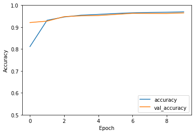

# Patchless MLP-Mixer

This is a preliminary exploration of an even simpler [MLP-Mixer](https://arxiv.org/abs/2105.01601) style architecture.

This architecture:
- Uses image rows and columns directly, instead of [image patches -> tokens].
- Uses a (novel?) classification method, heavily inspired by MLP-Mixer.
- Enables models to be deep.
- Has a low parameter count, for relatively large images and depths.

It looks fairly promising (warrenting further investigation):
- Initial results (on MNIST and CIFAR-10) are good.
- The model is capable of overfitting MNIST and CIFAR-10, suggesting that it might do well with larger, more varied datasets.

Would also be interesting to see how well it works for saliency, object localization, etc, since output has same dimension as input.

Discussion of CIFAR-10 results:
The model is trained from scratch on CIFAR-10, 
and does worse than a CNN of similar parameter size would do.
However, the architecture is less biased than a CNN, 
so I hypothesize that it will work well
if first pre-trained on much larger datasets (which was also the case for Mixer-MLP).

I'm not currently set-up (in terms of hardware/VMs) to train on ImageNet size datasets, so watch this space.

## Patchless MLP-Mixer layer


The above is a single patchless MLP-Mixer stye layer. 
Note that the implementation multiplies the output representation by a learnable scalar,
initialised to 0,
before adding the input image to it,
meaning that the function before training is the identity function
(this isn't shown on the diagram).
The number of these layers to use is a hyperparameter to be tuned.

# Row-Column representation classifier


Note that MLP1 and MLP2 are unique networks, different from each other, (and not the same as the ones in the previous diagram).

---

```python
import matplotlib.pyplot as plt
import numpy as np
import tensorflow as tf
from tensorflow.keras import datasets, layers
```


```python
class NdMixer(layers.Layer):
    "N-dimensional MLP mixer, without batchnorm or skip connections."

    def __init__(self, outshape: tuple, Net: layers.Layer, 
                 order: tuple=None, gate: bool=True):
        """ 
        Args:
            outshape: The output shape, not including samples dimension. 
                Must have same dimensionality as input.

            order: Order that dimensions are processed.
                Like Keras' Permutation, doesn't include samples dimension.
        """
        super().__init__()
        self.ndim = len(outshape)
        self.order = order if order else range(1, len(outshape)+1)
        self.nets = [Net(size) for size in outshape] 
        self.gate = ScalarGate() if gate else lambda x: x

    def __call__(self, input):
        h = input
        for i in self.order:
            h = apply_net_to_axis(h, self.nets[i - 1], i)
        return self.gate(h)

class ScalarGate(layers.Layer):
    def __init__(self):
        super().__init__()
        self.value = tf.Variable(0.0, trainable=True)

    def call(self, inputs):
        return self.value * inputs

class MLP(layers.Layer):
    def __init__(self, outsize, hidden_size=None):
        super().__init__()
        hidden_size = hidden_size if hidden_size else outsize
        self.layer_1 = layers.Dense(hidden_size, activation=tf.nn.gelu)
        self.layer_2 = layers.Dense(outsize)

    def call(self, inputs):
        h = self.layer_1(inputs)
        return self.layer_2(h)

def apply_net_to_axis(x, net, axis):
    perm = list(range(len(x.shape)))
    perm[axis], perm[-1] = perm[-1], perm[axis]
    h = tf.transpose(x, perm)
    h = net(h)
    return tf.transpose(h, perm)

class ResidualLayers(layers.Layer):
    def __init__(self, num_layers, make_layer, gamma=0.9):
        super().__init__()
        self.layers = [make_layer() for _ in range(num_layers)]
        self.gamma = gamma

    def call(self, inputs):  # momentum ResNets
        v = 0
        h = inputs
        for layer in self.layers:
            v = self.gamma * v + (1 - self.gamma) * layer(h)
            h = h + v
        return h

class Layers(layers.Layer):
    def __init__(self, num_layers, make_layer):
        super().__init__()
        self.layers = [make_layer() for _ in range(num_layers)]
    
    def call(self, inputs):
        h = inputs
        for layer in self.layers:
            h = layer(h)
        return h

def RowColClf(height, width, num_classes, Net=MLP, name=None):
    "Rather than average pooling, use MLP for rows, cols, then concat."
    inputs = tf.keras.layers.Input(shape=(height, width))
    rows_out = Net(1)(inputs)
    rows_out = tf.keras.layers.Lambda(lambda x: x[:, :, 0])(rows_out)
    cols_out = tf.keras.layers.Permute([2, 1])(inputs)
    cols_out = Net(1)(cols_out)
    cols_out = tf.keras.layers.Lambda(lambda x: x[:, :, 0])(cols_out)
    concat = tf.keras.layers.Concatenate()([rows_out, cols_out])
    flat = tf.keras.layers.Flatten()(concat)
    y = tf.keras.layers.Dense(num_classes)(flat)
    return tf.keras.Model(inputs=inputs, outputs=y, name=name)


def autoencoder(shape, num_mix_layers):
    """Autoencoder via mixer layers. Note, skip connections aren't used here, 
    otherwise network is trivially the identity function."""
    inputs = tf.keras.layers.Input(shape)
    h = inputs
    for _ in range(num_mix_layers):
        h = NdMixer(shape, MLP, gate=False)(h)
    return tf.keras.Model(inputs=inputs, outputs=h)

```

# MNIST


```python
(train_images, train_labels), (test_images, test_labels) = datasets.mnist.load_data()
train_images, test_images = train_images / 255.0, test_images / 255.0
train_images, test_images = train_images.astype(np.float32), test_images.astype(np.float32)

height, width = train_images.shape[-2:]
num_classes = 10
```


```python
# Assert that the model is initialised as identify function.
num_mix_layers = 16
make_mixer = lambda: NdMixer([height, width], MLP, gate=True)
inputs = tf.keras.layers.Input(shape=(height, width))
mixer_layers = ResidualLayers(num_mix_layers, make_mixer)(inputs)
model = tf.keras.Model(inputs=inputs, outputs=mixer_layers)
assert np.sum(model.predict(train_images[0:100, ...]) - train_images[0:100, ...]) == 0
```

## Classifier


```python
num_mix_layers = 16
Net = lambda outsize: MLP(outsize, hidden_size=256)
make_mixer = lambda: NdMixer([height, width], Net, gate=True)

inputs = tf.keras.layers.Input(shape=(height, width))
linmap_in = NdMixer([height, width], layers.Dense, gate=False)(inputs)
mixer_layers = ResidualLayers(num_mix_layers, make_mixer)(linmap_in)
linmap_out = NdMixer([12, 12], layers.Dense, gate=False)(mixer_layers)  # make a tractable size
flat = tf.keras.layers.Flatten()(linmap_out)
y = tf.keras.layers.Dense(num_classes)(flat)
model = tf.keras.Model(inputs=inputs, outputs=y)

print(model.summary())
model.compile(optimizer='adam',
              loss=tf.keras.losses.SparseCategoricalCrossentropy(from_logits=True),
              metrics=['accuracy'])
history = model.fit(train_images, train_labels, batch_size=64, epochs=10, 
                    validation_data=(test_images, test_labels))

# PLOTS
plt.plot(history.history['accuracy'], label='accuracy')
plt.plot(history.history['val_accuracy'], label = 'val_accuracy')
plt.xlabel('Epoch')
plt.ylabel('Accuracy')
plt.ylim([.8, 1])
plt.legend(loc='lower right')
plt.show()
```

    Model: "model_11"
    _________________________________________________________________
    Layer (type)                 Output Shape              Param #   
    =================================================================
    input_12 (InputLayer)        [(None, 28, 28)]          0         
    _________________________________________________________________
    tf.compat.v1.transpose_8 (TF (None, 28, 28)            0         
    _________________________________________________________________
    dense_709 (Dense)            (None, 28, 28)            812       
    _________________________________________________________________
    tf.compat.v1.transpose_9 (TF (None, 28, 28)            0         
    _________________________________________________________________
    tf.compat.v1.transpose_10 (T (None, 28, 28)            0         
    _________________________________________________________________
    dense_710 (Dense)            (None, 28, 28)            812       
    _________________________________________________________________
    tf.compat.v1.transpose_11 (T (None, 28, 28)            0         
    _________________________________________________________________
    residual_layers_11 (Residual (None, 28, 28)            467856    
    _________________________________________________________________
    tf.compat.v1.transpose_12 (T (None, 28, 28)            0         
    _________________________________________________________________
    dense_775 (Dense)            (None, 28, 12)            348       
    _________________________________________________________________
    tf.compat.v1.transpose_13 (T (None, 12, 28)            0         
    _________________________________________________________________
    tf.compat.v1.transpose_14 (T (None, 12, 28)            0         
    _________________________________________________________________
    dense_776 (Dense)            (None, 12, 12)            348       
    _________________________________________________________________
    tf.compat.v1.transpose_15 (T (None, 12, 12)            0         
    _________________________________________________________________
    flatten_1 (Flatten)          (None, 144)               0         
    _________________________________________________________________
    dense_777 (Dense)            (None, 10)                1450      
    =================================================================
    Total params: 471,626
    Trainable params: 471,626
    Non-trainable params: 0
    _________________________________________________________________
    None
    Epoch 1/10
    938/938 [==============================] - 40s 34ms/step - loss: 0.6668 - accuracy: 0.7812 - val_loss: 0.1505 - val_accuracy: 0.9542
    Epoch 2/10
    938/938 [==============================] - 30s 32ms/step - loss: 0.1258 - accuracy: 0.9630 - val_loss: 0.0970 - val_accuracy: 0.9678
    Epoch 3/10
    938/938 [==============================] - 30s 32ms/step - loss: 0.0769 - accuracy: 0.9761 - val_loss: 0.0858 - val_accuracy: 0.9731
    Epoch 4/10
    938/938 [==============================] - 31s 33ms/step - loss: 0.0600 - accuracy: 0.9820 - val_loss: 0.0779 - val_accuracy: 0.9745
    Epoch 5/10
    938/938 [==============================] - 30s 32ms/step - loss: 0.0474 - accuracy: 0.9847 - val_loss: 0.0652 - val_accuracy: 0.9810
    Epoch 6/10
    938/938 [==============================] - 30s 32ms/step - loss: 0.0371 - accuracy: 0.9877 - val_loss: 0.0617 - val_accuracy: 0.9825
    Epoch 7/10
    938/938 [==============================] - 30s 32ms/step - loss: 0.0303 - accuracy: 0.9904 - val_loss: 0.0759 - val_accuracy: 0.9791
    Epoch 8/10
    938/938 [==============================] - 30s 32ms/step - loss: 0.0289 - accuracy: 0.9903 - val_loss: 0.0713 - val_accuracy: 0.9804
    Epoch 9/10
    938/938 [==============================] - 30s 32ms/step - loss: 0.0230 - accuracy: 0.9928 - val_loss: 0.0674 - val_accuracy: 0.9820
    Epoch 10/10
    938/938 [==============================] - 30s 32ms/step - loss: 0.0211 - accuracy: 0.9930 - val_loss: 0.0534 - val_accuracy: 0.9865


    

    


```python
"With linear mixer to modify the size of the hidden representation (which affects MLP size)."
num_mix_layers = 8
Net = lambda outsize: MLP(outsize, hidden_size=256)
make_mixer = lambda: NdMixer([8, 8], Net, gate=True)

inputs = tf.keras.layers.Input(shape=(height, width))
linmap_in = NdMixer([8, 8], layers.Dense, gate=False)(inputs)
mixer_layers = ResidualLayers(num_mix_layers, make_mixer)(linmap_in)
linmap_out = NdMixer([12, 12], layers.Dense, gate=False)(mixer_layers)  # make a tractable size
flat = tf.keras.layers.Flatten()(linmap_out)
y = tf.keras.layers.Dense(num_classes)(flat)
model = tf.keras.Model(inputs=inputs, outputs=y)

print(model.summary())
model.compile(optimizer='adam',
              loss=tf.keras.losses.SparseCategoricalCrossentropy(from_logits=True),
              metrics=['accuracy'])
history = model.fit(train_images, train_labels, batch_size=64, epochs=10, 
                    validation_data=(test_images, test_labels))

# PLOTS
plt.plot(history.history['accuracy'], label='accuracy')
plt.plot(history.history['val_accuracy'], label = 'val_accuracy')
plt.xlabel('Epoch')
plt.ylabel('Accuracy')
plt.ylim([.8, 1])
plt.legend(loc='lower right')
plt.show()
```

    Model: "model_16"
    _________________________________________________________________
    Layer (type)                 Output Shape              Param #   
    =================================================================
    input_15 (InputLayer)        [(None, 28, 28)]          0         
    _________________________________________________________________
    tf.compat.v1.transpose_24 (T (None, 28, 28)            0         
    _________________________________________________________________
    dense_815 (Dense)            (None, 28, 8)             232       
    _________________________________________________________________
    tf.compat.v1.transpose_25 (T (None, 8, 28)             0         
    _________________________________________________________________
    tf.compat.v1.transpose_26 (T (None, 8, 28)             0         
    _________________________________________________________________
    dense_816 (Dense)            (None, 8, 8)              232       
    _________________________________________________________________
    tf.compat.v1.transpose_27 (T (None, 8, 8)              0         
    _________________________________________________________________
    residual_layers_13 (Residual (None, 8, 8)              69768     
    _________________________________________________________________
    tf.compat.v1.transpose_28 (T (None, 8, 8)              0         
    _________________________________________________________________
    dense_849 (Dense)            (None, 8, 12)             108       
    _________________________________________________________________
    tf.compat.v1.transpose_29 (T (None, 12, 8)             0         
    _________________________________________________________________
    tf.compat.v1.transpose_30 (T (None, 12, 8)             0         
    _________________________________________________________________
    dense_850 (Dense)            (None, 12, 12)            108       
    _________________________________________________________________
    tf.compat.v1.transpose_31 (T (None, 12, 12)            0         
    _________________________________________________________________
    flatten_3 (Flatten)          (None, 144)               0         
    _________________________________________________________________
    dense_851 (Dense)            (None, 10)                1450      
    =================================================================
    Total params: 71,898
    Trainable params: 71,898
    Non-trainable params: 0
    _________________________________________________________________
    None
    Epoch 1/10
    938/938 [==============================] - 20s 17ms/step - loss: 0.9107 - accuracy: 0.7002 - val_loss: 0.2148 - val_accuracy: 0.9355
    Epoch 2/10
    938/938 [==============================] - 15s 16ms/step - loss: 0.2141 - accuracy: 0.9360 - val_loss: 0.1628 - val_accuracy: 0.9477
    Epoch 3/10
    938/938 [==============================] - 16s 17ms/step - loss: 0.1466 - accuracy: 0.9555 - val_loss: 0.1330 - val_accuracy: 0.9581
    Epoch 4/10
    938/938 [==============================] - 15s 16ms/step - loss: 0.1146 - accuracy: 0.9653 - val_loss: 0.1256 - val_accuracy: 0.9616
    Epoch 5/10
    938/938 [==============================] - 15s 16ms/step - loss: 0.0981 - accuracy: 0.9701 - val_loss: 0.0985 - val_accuracy: 0.9691
    Epoch 6/10
    938/938 [==============================] - 15s 16ms/step - loss: 0.0856 - accuracy: 0.9733 - val_loss: 0.1027 - val_accuracy: 0.9672
    Epoch 7/10
    938/938 [==============================] - 15s 16ms/step - loss: 0.0755 - accuracy: 0.9763 - val_loss: 0.0950 - val_accuracy: 0.9703
    Epoch 8/10
    938/938 [==============================] - 15s 16ms/step - loss: 0.0703 - accuracy: 0.9785 - val_loss: 0.0949 - val_accuracy: 0.9724
    Epoch 9/10
    938/938 [==============================] - 15s 16ms/step - loss: 0.0613 - accuracy: 0.9810 - val_loss: 0.0957 - val_accuracy: 0.9704
    Epoch 10/10
    938/938 [==============================] - 15s 16ms/step - loss: 0.0568 - accuracy: 0.9817 - val_loss: 0.0842 - val_accuracy: 0.9758


    

    


```python
mixfunc = tf.keras.backend.function([inputs], [mixer_layers])

plt.figure(figsize=(5, 16))
for i in range(20):
    im = train_images[i:i+1,...]

    plt.subplot(20, 2, i*2+1)
    plt.imshow(im[0, ...], vmin=0, vmax=1, cmap='gray')
    plt.axis('off')

    plt.subplot(20, 2, i*2+2)
    plt.imshow(mixfunc(im)[0][0,...], cmap='gray')
    plt.axis('off')

plt.tight_layout()
plt.show()
```


    

    


```python
"Average representations per class."

avgs = []
plt.figure(figsize=(10,10))
for i in range(10):
    plt.subplot(5, 5, i+1)
    representations = mixfunc(train_images[train_labels==i,...])[0]
    av = np.mean(representations, axis=0)
    plt.title(np.std(representations))
    plt.imshow(av, cmap='gray')

    avgs.append(av)
    plt.axis('off')

plt.tight_layout()
plt.show()
```


    

    


```python
avgs_np = np.stack(avgs).reshape(10, -1)
diffs = (avgs_np.reshape(10, -1, 16) - avgs_np.reshape(-1, 10, 16))**2
diffs = np.sqrt(np.mean(diffs, axis=-1))
plt.imshow(diffs, cmap='gray')
plt.title('Euclidian distance between average class representations.')
plt.xlabel('Class')
plt.ylabel('Class')
```


    Text(0, 0.5, 'Class')


    

    


## Autoencoder

Note that skip connections are removed for the autoencoder model, because they would cause the model to be initialised as the identity function, (due to the initial 0 scalar gate), which would make the model trivially an autoencoder.


```python
num_mix_layers = 2
Net = lambda outsize: MLP(outsize, hidden_size=outsize)
make_mixer = lambda: NdMixer([height, width], Net, gate=False)

inputs = tf.keras.layers.Input(shape=(height, width))
mixer_layers = Layers(num_mix_layers, make_mixer)(inputs)
model = tf.keras.Model(inputs=inputs, outputs=mixer_layers)

print(model.summary())
model.compile(optimizer='adam',
              loss='mse',
              metrics=[tf.keras.metrics.RootMeanSquaredError()])
history = model.fit(train_images, train_images, batch_size=64, epochs=10, 
                    validation_data=(test_images, test_images))

# PLOTS
plt.plot(history.history['root_mean_squared_error'], label='root_mean_squared_error')
plt.plot(history.history['val_root_mean_squared_error'], label = 'val_root_mean_squared_error')
plt.xlabel('Epoch')
plt.ylabel('RMSE')
plt.ylim([0, .2])
plt.legend()
test_loss, test_acc = model.evaluate(test_images,  test_images, verbose=2)

for i in range(5):
    im = train_images[i:i+1,...]

    plt.subplot(2, 5, i+1)
    plt.imshow(im[0,...], cmap='gray', vmin=0, vmax=1)
    plt.axis('off')
    plt.title(f'Input {i}')

    plt.subplot(2, 5, i+6)
    plt.imshow(model.predict(im)[0,...], cmap='gray', vmin=0, vmax=1)
    plt.axis('off')
    plt.title(f'Output {i}')

plt.suptitle("Autoencoder results")
plt.tight_layout()
plt.show()
```

    Model: "model_1"
    _________________________________________________________________
    Layer (type)                 Output Shape              Param #   
    =================================================================
    input_4 (InputLayer)         [(None, 28, 28)]          0         
    _________________________________________________________________
    layers_1 (Layers)            (None, 28, 28)            6496      
    =================================================================
    Total params: 6,496
    Trainable params: 6,496
    Non-trainable params: 0
    _________________________________________________________________
    None
    Epoch 1/10
    938/938 [==============================] - 6s 5ms/step - loss: 0.0354 - root_mean_squared_error: 0.1799 - val_loss: 0.0026 - val_root_mean_squared_error: 0.0514
    Epoch 2/10
    938/938 [==============================] - 4s 5ms/step - loss: 0.0021 - root_mean_squared_error: 0.0456 - val_loss: 0.0010 - val_root_mean_squared_error: 0.0324
    Epoch 3/10
    938/938 [==============================] - 4s 5ms/step - loss: 9.0787e-04 - root_mean_squared_error: 0.0301 - val_loss: 6.2453e-04 - val_root_mean_squared_error: 0.0250
    Epoch 4/10
    938/938 [==============================] - 4s 5ms/step - loss: 5.6872e-04 - root_mean_squared_error: 0.0238 - val_loss: 3.7994e-04 - val_root_mean_squared_error: 0.0195
    Epoch 5/10
    938/938 [==============================] - 4s 5ms/step - loss: 3.6520e-04 - root_mean_squared_error: 0.0191 - val_loss: 2.9258e-04 - val_root_mean_squared_error: 0.0171
    Epoch 6/10
    938/938 [==============================] - 4s 5ms/step - loss: 2.8994e-04 - root_mean_squared_error: 0.0170 - val_loss: 2.5313e-04 - val_root_mean_squared_error: 0.0159
    Epoch 7/10
    938/938 [==============================] - 4s 5ms/step - loss: 2.5373e-04 - root_mean_squared_error: 0.0159 - val_loss: 2.2105e-04 - val_root_mean_squared_error: 0.0149
    Epoch 8/10
    938/938 [==============================] - 4s 5ms/step - loss: 2.2844e-04 - root_mean_squared_error: 0.0151 - val_loss: 2.2703e-04 - val_root_mean_squared_error: 0.0151
    Epoch 9/10
    938/938 [==============================] - 4s 5ms/step - loss: 2.1039e-04 - root_mean_squared_error: 0.0145 - val_loss: 1.9263e-04 - val_root_mean_squared_error: 0.0139
    Epoch 10/10
    938/938 [==============================] - 5s 5ms/step - loss: 1.9487e-04 - root_mean_squared_error: 0.0140 - val_loss: 1.8636e-04 - val_root_mean_squared_error: 0.0137
    313/313 - 1s - loss: 1.8636e-04 - root_mean_squared_error: 0.0137


    

    


# CIFAR-10


```python
(train_images, train_labels), (test_images, test_labels) = datasets.cifar10.load_data()
train_images, test_images = train_images / 255.0, test_images / 255.0
train_images, test_images = train_images.astype(np.float32), test_images.astype(np.float32)
height, width, channels = 32, 32, 3
num_classes = 10
```

    Downloading data from https://www.cs.toronto.edu/~kriz/cifar-10-python.tar.gz
    170500096/170498071 [==============================] - 11s 0us/step


## Classifier


```python
num_mix_layers = 16
net = lambda outsize: MLP(outsize, hidden_size=128)
make_mixer = lambda: NdMixer([height, width, channels], net, gate=False)

inputs = tf.keras.layers.Input(shape=(height, width, channels))
linmap_in = NdMixer([height, width, channels], layers.Dense, gate=False)(inputs)
mixer_layers = ResidualLayers(num_mix_layers, make_mixer)(linmap_in)
linmap_out = NdMixer([20, 20, 1], layers.Dense, gate=False)(mixer_layers)  # make a tractable size
flat = tf.keras.layers.Flatten()(linmap_out)
y = tf.keras.layers.Dense(num_classes)(flat)
model = tf.keras.Model(inputs=inputs, outputs=y)

print(model.summary())
model.compile(optimizer='adam',
              loss=tf.keras.losses.SparseCategoricalCrossentropy(from_logits=True),
              metrics=['accuracy'])
history = model.fit(train_images, train_labels, batch_size=64, epochs=10, 
                    validation_data=(test_images, test_labels))

# PLOTS
plt.plot(history.history['accuracy'], label='accuracy')
plt.plot(history.history['val_accuracy'], label = 'val_accuracy')
plt.xlabel('Epoch')
plt.ylabel('Accuracy')
plt.ylim([0, 1])
plt.legend(loc='lower right')
```

    Model: "model"
    _________________________________________________________________
    Layer (type)                 Output Shape              Param #   
    =================================================================
    input_1 (InputLayer)         [(None, 32, 32, 3)]       0         
    _________________________________________________________________
    tf.compat.v1.transpose (TFOp (None, 3, 32, 32)         0         
    _________________________________________________________________
    dense (Dense)                (None, 3, 32, 32)         1056      
    _________________________________________________________________
    tf.compat.v1.transpose_1 (TF (None, 32, 32, 3)         0         
    _________________________________________________________________
    tf.compat.v1.transpose_2 (TF (None, 32, 3, 32)         0         
    _________________________________________________________________
    dense_1 (Dense)              (None, 32, 3, 32)         1056      
    _________________________________________________________________
    tf.compat.v1.transpose_3 (TF (None, 32, 32, 3)         0         
    _________________________________________________________________
    tf.compat.v1.transpose_4 (TF (None, 32, 32, 3)         0         
    _________________________________________________________________
    dense_2 (Dense)              (None, 32, 32, 3)         12        
    _________________________________________________________________
    tf.compat.v1.transpose_5 (TF (None, 32, 32, 3)         0         
    _________________________________________________________________
    residual_layers (ResidualLay (None, 32, 32, 3)         563296    
    _________________________________________________________________
    tf.compat.v1.transpose_6 (TF (None, 3, 32, 32)         0         
    _________________________________________________________________
    dense_195 (Dense)            (None, 3, 32, 12)         396       
    _________________________________________________________________
    tf.compat.v1.transpose_7 (TF (None, 12, 32, 3)         0         
    _________________________________________________________________
    tf.compat.v1.transpose_8 (TF (None, 12, 3, 32)         0         
    _________________________________________________________________
    dense_196 (Dense)            (None, 12, 3, 12)         396       
    _________________________________________________________________
    tf.compat.v1.transpose_9 (TF (None, 12, 12, 3)         0         
    _________________________________________________________________
    tf.compat.v1.transpose_10 (T (None, 12, 12, 3)         0         
    _________________________________________________________________
    dense_197 (Dense)            (None, 12, 12, 1)         4         
    _________________________________________________________________
    tf.compat.v1.transpose_11 (T (None, 12, 12, 1)         0         
    _________________________________________________________________
    flatten (Flatten)            (None, 144)               0         
    _________________________________________________________________
    dense_198 (Dense)            (None, 10)                1450      
    =================================================================
    Total params: 567,666
    Trainable params: 567,666
    Non-trainable params: 0
    _________________________________________________________________
    None
    Epoch 1/10
    782/782 [==============================] - 245s 283ms/step - loss: 1.8664 - accuracy: 0.3288 - val_loss: 1.4788 - val_accuracy: 0.4782
    Epoch 2/10
    782/782 [==============================] - 215s 275ms/step - loss: 1.3736 - accuracy: 0.5197 - val_loss: 1.2899 - val_accuracy: 0.5416
    Epoch 3/10
    782/782 [==============================] - 215s 274ms/step - loss: 1.1613 - accuracy: 0.5914 - val_loss: 1.2004 - val_accuracy: 0.5795
    Epoch 4/10
    782/782 [==============================] - 214s 273ms/step - loss: 0.9851 - accuracy: 0.6494 - val_loss: 1.1530 - val_accuracy: 0.5947
    Epoch 5/10
    782/782 [==============================] - 213s 273ms/step - loss: 0.8443 - accuracy: 0.7027 - val_loss: 1.1355 - val_accuracy: 0.6048
    Epoch 6/10
    782/782 [==============================] - 214s 274ms/step - loss: 0.7071 - accuracy: 0.7496 - val_loss: 1.1793 - val_accuracy: 0.6035
    Epoch 7/10
    782/782 [==============================] - 213s 273ms/step - loss: 0.5891 - accuracy: 0.7915 - val_loss: 1.2791 - val_accuracy: 0.6002
    Epoch 8/10
    782/782 [==============================] - 214s 273ms/step - loss: 0.4841 - accuracy: 0.8282 - val_loss: 1.3895 - val_accuracy: 0.5960
    Epoch 9/10
    782/782 [==============================] - 213s 273ms/step - loss: 0.4109 - accuracy: 0.8554 - val_loss: 1.4717 - val_accuracy: 0.5932
    Epoch 10/10
    782/782 [==============================] - 213s 273ms/step - loss: 0.3482 - accuracy: 0.8767 - val_loss: 1.5331 - val_accuracy: 0.5946


    <matplotlib.legend.Legend at 0x7f379ed00e10>


    

    


```python
plt.figure(figsize=(10, 20))
mixfunc = tf.keras.backend.function([inputs], [mixer_layers])
for i in range(20):
    im = train_images[i:i+1,...]
    pred = mixfunc(im)[0][0,...]
    pred_norm = (pred - np.mean(pred)) / np.std(pred) + 0.5
    pred_norm = np.clip(pred_norm, 0, 1)

    plt.subplot(20, 2, i*2+1)
    plt.imshow(im[0, ...], vmin=0, vmax=1)
    plt.axis('off')

    plt.subplot(20, 2, i*2+2)
    plt.imshow(pred_norm)
    plt.axis('off')

plt.tight_layout()
plt.show()
```


    

    


```python
"With linear mapping to modify the size of the hidden representation (and therefore MLP size)."
num_mix_layers = 4
repheight, repwidth = 64, 64
net = lambda outsize: MLP(outsize, hidden_size=outsize)
make_mixer = lambda: NdMixer([repheight, repwidth, channels], net, gate=False)

inputs = tf.keras.layers.Input(shape=(height, width, channels))
linmap_in = NdMixer([repheight, repwidth, channels], layers.Dense, gate=False)(inputs)
mixer_layers = ResidualLayers(num_mix_layers, make_mixer)(linmap_in)
linmap_out = NdMixer([20, 20, 1], layers.Dense, gate=False)(mixer_layers)  # make a tractable size
flat = tf.keras.layers.Flatten()(linmap_out)
y = tf.keras.layers.Dense(num_classes)(flat)
model = tf.keras.Model(inputs=inputs, outputs=y)

print(model.summary())
model.compile(optimizer='adam',
              loss=tf.keras.losses.SparseCategoricalCrossentropy(from_logits=True),
              metrics=['accuracy'])
history = model.fit(train_images, train_labels, batch_size=64, epochs=10, 
                    validation_data=(test_images, test_labels))

# PLOTS
plt.plot(history.history['accuracy'], label='accuracy')
plt.plot(history.history['val_accuracy'], label = 'val_accuracy')
plt.xlabel('Epoch')
plt.ylabel('Accuracy')
plt.ylim([0, 1])
plt.legend(loc='lower right')
plt.show()
```

    Model: "model_2"
    _________________________________________________________________
    Layer (type)                 Output Shape              Param #   
    =================================================================
    input_5 (InputLayer)         [(None, 32, 32, 3)]       0         
    _________________________________________________________________
    tf.compat.v1.transpose (TFOp (None, 3, 32, 32)         0         
    _________________________________________________________________
    dense_80 (Dense)             (None, 3, 32, 64)         2112      
    _________________________________________________________________
    tf.compat.v1.transpose_1 (TF (None, 64, 32, 3)         0         
    _________________________________________________________________
    tf.compat.v1.transpose_2 (TF (None, 64, 3, 32)         0         
    _________________________________________________________________
    dense_81 (Dense)             (None, 64, 3, 64)         2112      
    _________________________________________________________________
    tf.compat.v1.transpose_3 (TF (None, 64, 64, 3)         0         
    _________________________________________________________________
    tf.compat.v1.transpose_4 (TF (None, 64, 64, 3)         0         
    _________________________________________________________________
    dense_82 (Dense)             (None, 64, 64, 3)         12        
    _________________________________________________________________
    tf.compat.v1.transpose_5 (TF (None, 64, 64, 3)         0         
    _________________________________________________________________
    residual_layers_1 (ResidualL (None, 64, 64, 3)         66656     
    _________________________________________________________________
    tf.compat.v1.transpose_6 (TF (None, 3, 64, 64)         0         
    _________________________________________________________________
    dense_107 (Dense)            (None, 3, 64, 20)         1300      
    _________________________________________________________________
    tf.compat.v1.transpose_7 (TF (None, 20, 64, 3)         0         
    _________________________________________________________________
    tf.compat.v1.transpose_8 (TF (None, 20, 3, 64)         0         
    _________________________________________________________________
    dense_108 (Dense)            (None, 20, 3, 20)         1300      
    _________________________________________________________________
    tf.compat.v1.transpose_9 (TF (None, 20, 20, 3)         0         
    _________________________________________________________________
    tf.compat.v1.transpose_10 (T (None, 20, 20, 3)         0         
    _________________________________________________________________
    dense_109 (Dense)            (None, 20, 20, 1)         4         
    _________________________________________________________________
    tf.compat.v1.transpose_11 (T (None, 20, 20, 1)         0         
    _________________________________________________________________
    flatten (Flatten)            (None, 400)               0         
    _________________________________________________________________
    dense_110 (Dense)            (None, 10)                4010      
    =================================================================
    Total params: 77,506
    Trainable params: 77,506
    Non-trainable params: 0
    _________________________________________________________________
    None
    Epoch 1/10
    782/782 [==============================] - 41s 48ms/step - loss: 1.9175 - accuracy: 0.3039 - val_loss: 1.4122 - val_accuracy: 0.4982
    Epoch 2/10
    782/782 [==============================] - 37s 47ms/step - loss: 1.3725 - accuracy: 0.5153 - val_loss: 1.2554 - val_accuracy: 0.5489
    Epoch 3/10
    782/782 [==============================] - 37s 47ms/step - loss: 1.2066 - accuracy: 0.5720 - val_loss: 1.1937 - val_accuracy: 0.5718
    Epoch 4/10
    782/782 [==============================] - 37s 47ms/step - loss: 1.1140 - accuracy: 0.6079 - val_loss: 1.1718 - val_accuracy: 0.5808
    Epoch 5/10
    782/782 [==============================] - 37s 47ms/step - loss: 1.0388 - accuracy: 0.6318 - val_loss: 1.1121 - val_accuracy: 0.6011
    Epoch 6/10
    782/782 [==============================] - 37s 47ms/step - loss: 0.9729 - accuracy: 0.6568 - val_loss: 1.0943 - val_accuracy: 0.6107
    Epoch 7/10
    782/782 [==============================] - 37s 47ms/step - loss: 0.9171 - accuracy: 0.6781 - val_loss: 1.0860 - val_accuracy: 0.6205
    Epoch 8/10
    782/782 [==============================] - 37s 47ms/step - loss: 0.8682 - accuracy: 0.6924 - val_loss: 1.0816 - val_accuracy: 0.6280
    Epoch 9/10
    782/782 [==============================] - 37s 47ms/step - loss: 0.8267 - accuracy: 0.7090 - val_loss: 1.0901 - val_accuracy: 0.6238
    Epoch 10/10
    782/782 [==============================] - 37s 47ms/step - loss: 0.7701 - accuracy: 0.7280 - val_loss: 1.1204 - val_accuracy: 0.6247


    

    


## Autoencoder

Note that skip connections are removed for the autoencoder model, because they would cause the model to be initialised as the identity function, (due to the initial 0 scalar gate), which would make the model trivially an autoencoder.


```python
num_mix_layers = 2
Net = lambda outsize: MLP(outsize, hidden_size=outsize)
make_mixer = lambda: NdMixer([height, width, channels], Net, gate=False)

inputs = tf.keras.layers.Input(shape=(height, width, channels))
mixer_layers = Layers(num_mix_layers, make_mixer)(inputs)
model = tf.keras.Model(inputs=inputs, outputs=mixer_layers)

print(model.summary())
model.compile(optimizer='adam',
              loss='mse',
              metrics=[tf.keras.metrics.RootMeanSquaredError()])
history = model.fit(train_images, train_images, batch_size=64, epochs=10, 
                    validation_data=(test_images, test_images))

plt.plot(history.history['root_mean_squared_error'], label='root_mean_squared_error')
plt.plot(history.history['val_root_mean_squared_error'], label = 'val_root_mean_squared_error')
plt.xlabel('Epoch')
plt.ylabel('RMSE')
plt.ylim([0, .2])
plt.legend()
test_loss, test_acc = model.evaluate(test_images,  test_images, verbose=2)
```

    Model: "model_3"
    _________________________________________________________________
    Layer (type)                 Output Shape              Param #   
    =================================================================
    input_6 (InputLayer)         [(None, 32, 32, 3)]       0         
    _________________________________________________________________
    layers_2 (Layers)            (None, 32, 32, 3)         8496      
    =================================================================
    Total params: 8,496
    Trainable params: 8,496
    Non-trainable params: 0
    _________________________________________________________________
    None
    Epoch 1/10
    782/782 [==============================] - 9s 10ms/step - loss: 0.0707 - root_mean_squared_error: 0.2532 - val_loss: 0.0093 - val_root_mean_squared_error: 0.0963
    Epoch 2/10
    782/782 [==============================] - 7s 10ms/step - loss: 0.0077 - root_mean_squared_error: 0.0878 - val_loss: 0.0040 - val_root_mean_squared_error: 0.0631
    Epoch 3/10
    782/782 [==============================] - 7s 10ms/step - loss: 0.0035 - root_mean_squared_error: 0.0588 - val_loss: 0.0024 - val_root_mean_squared_error: 0.0490
    Epoch 4/10
    782/782 [==============================] - 8s 10ms/step - loss: 0.0022 - root_mean_squared_error: 0.0471 - val_loss: 0.0017 - val_root_mean_squared_error: 0.0415
    Epoch 5/10
    782/782 [==============================] - 7s 10ms/step - loss: 0.0017 - root_mean_squared_error: 0.0407 - val_loss: 0.0018 - val_root_mean_squared_error: 0.0424
    Epoch 6/10
    782/782 [==============================] - 8s 10ms/step - loss: 0.0014 - root_mean_squared_error: 0.0369 - val_loss: 0.0015 - val_root_mean_squared_error: 0.0390
    Epoch 7/10
    782/782 [==============================] - 7s 10ms/step - loss: 0.0012 - root_mean_squared_error: 0.0346 - val_loss: 0.0011 - val_root_mean_squared_error: 0.0331
    Epoch 8/10
    782/782 [==============================] - 7s 10ms/step - loss: 0.0010 - root_mean_squared_error: 0.0323 - val_loss: 9.0858e-04 - val_root_mean_squared_error: 0.0301
    Epoch 9/10
    782/782 [==============================] - 8s 10ms/step - loss: 9.2417e-04 - root_mean_squared_error: 0.0304 - val_loss: 8.2560e-04 - val_root_mean_squared_error: 0.0287
    Epoch 10/10
    782/782 [==============================] - 8s 10ms/step - loss: 8.2589e-04 - root_mean_squared_error: 0.0287 - val_loss: 9.9591e-04 - val_root_mean_squared_error: 0.0316
    313/313 - 1s - loss: 9.9591e-04 - root_mean_squared_error: 0.0316


    

    


```python
for i in range(5):
    im = train_images[i:i+1, ...]
    pred = model.predict(im)[0,...]
    pred = np.clip(pred, 0, 1)

    plt.subplot(2, 5, i+1)
    plt.imshow(im[0,:,:], cmap='gray', vmin=0, vmax=1)
    plt.axis('off')
    plt.title(f'Input {i}')

    plt.subplot(2, 5, i+6)
    plt.imshow(pred, cmap='gray', vmin=0, vmax=1)
    plt.axis('off')
    plt.title(f'Output {i}')

plt.suptitle("Autoencoder results")
plt.tight_layout()
plt.show()
```


    

    

