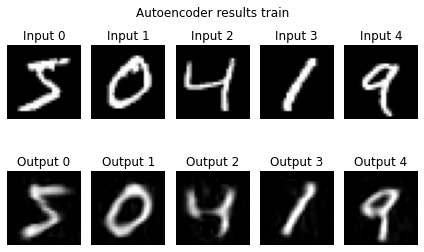
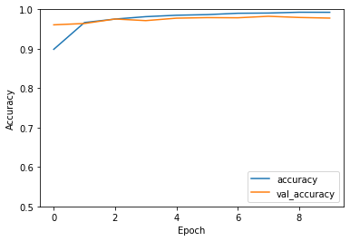

# Patchless MLP-Mixer

This is a preliminary exploration of an even simpler [MLP-Mixer](https://arxiv.org/abs/2105.01601) style architecture.

This architecture:
- Uses image rows and columns directly, instead of image patches.
- Uses a (novel?) classification method, heavily inspired by MLP-Mixer.
- Enables models to be deep.
- Has a low parameter count, for relatively large images and depths.

It looks fairly promising (warrenting further investigation):
- Initial results (on MNIST and CIFAR-10) are good.
- The model is capable of overfitting MNIST and CIFAR-10, suggesting that it might do well with larger, more varied datasets.

Would also be interesting to see how well it works for saliency, object localization, etc, since output has same dimension as input.

## Patchless MLP-Mixer layer


The above is a single patchless MLP-Mixer stye layer. 
Note that the implementation multiplies the output representation by a learnable scalar,
initialised to 0,
before adding the input image to it,
meaning that the function before training is the identity function
(this isn't shown on the diagram).
The number of these layers to use is a hyperparameter to be tuned.

# Row-Column representation classifier


Note that MLP1 and MLP2 are unique networks, different from each other, (and not the same as the ones in the previous diagram).

---

```python
import matplotlib.pyplot as plt
import numpy as np
import tensorflow as tf
from tensorflow.keras import datasets, layers
```


```python
class MLP(layers.Layer):
    def __init__(self, outsize):
        super().__init__()
        self.layer_1 = layers.Dense(outsize, activation=tf.nn.gelu)
        self.layer_2 = layers.Dense(outsize)

    def call(self, inputs):
        h = self.layer_1(inputs)
        return self.layer_2(h)

class Mixer(layers.Layer):
    def __init__(self, outheight, outwidth):
        super().__init__()
        self.layer_1 = MLP(outheight)
        self.layer_2 = MLP(outwidth)

    def call(self, inputs):
        h = tf.keras.layers.Permute((2, 1))(inputs)
        h = self.layer_1(h)
        h = tf.keras.layers.Permute((2, 1))(h)
        return self.layer_2(h)

class ScalarGate(tf.keras.layers.Layer):
    def __init__(self):
        super().__init__()
        self.value = tf.Variable(0.0, trainable=True)

    def call(self, inputs):
        return self.value * inputs

def patchless_mixer(height, width, num_classes, num_mix_layers, name=None):
    inputs = tf.keras.layers.Input(shape=(height, width))
    
    h = inputs
    for i in range(num_mix_layers):
        h = ScalarGate()(Mixer(height, width)(h)) + h
    
    # Classification:
    # Rather than average pooling, use MLP for rows, and then cols, then concat.
    rows_out = MLP(1)(h)
    rows_out = tf.keras.layers.Lambda(lambda x: x[:, :, 0])(rows_out)

    cols_out = tf.keras.layers.Permute((2, 1))(h)
    cols_out = MLP(1)(cols_out)
    cols_out = tf.keras.layers.Lambda(lambda x: x[:, :, 0])(cols_out)

    concat = tf.keras.layers.Concatenate()([rows_out, cols_out])
    flat = tf.keras.layers.Flatten()(concat)
    y = tf.keras.layers.Dense(num_classes)(flat)
    return tf.keras.Model(inputs=inputs, outputs=y, name=name)


def autoencoder(height, width, num_classes, num_mix_layers, name=None):
    """Autoencoder via mixer layers. Note, skip connections aren't used here, 
    otherwise network is trivially the identity function."""
    inputs = tf.keras.layers.Input(shape=(height, width))
    
    h = inputs
    for i in range(num_mix_layers):
        h = Mixer(height, width)(h)

    return tf.keras.Model(inputs=inputs, outputs=h, name=name)

```

# MNIST


```python
(train_images, train_labels), (test_images, test_labels) = datasets.mnist.load_data()
train_images, test_images = train_images / 255.0, test_images / 255.0
train_images, test_images = train_images.astype(np.float32), test_images.astype(np.float32)

height, width = train_images.shape[-2:]
num_classes = 10
```

## Classifier


```python
num_mix_layers = 16
model = patchless_mixer(height, width, num_classes, num_mix_layers)
# print(model.summary())
model.predict(train_images[:2, :, :])
model.compile(optimizer='adam',
              loss=tf.keras.losses.SparseCategoricalCrossentropy(from_logits=True),
              metrics=['accuracy'])
history = model.fit(train_images, train_labels, batch_size=64, epochs=10, 
                    validation_data=(test_images, test_labels))
```

    Epoch 1/10
    938/938 [==============================] - 38s 33ms/step - loss: 0.8026 - accuracy: 0.7325 - val_loss: 0.1206 - val_accuracy: 0.9625
    Epoch 2/10
    938/938 [==============================] - 29s 31ms/step - loss: 0.1205 - accuracy: 0.9631 - val_loss: 0.0977 - val_accuracy: 0.9706
    Epoch 3/10
    938/938 [==============================] - 29s 31ms/step - loss: 0.0798 - accuracy: 0.9750 - val_loss: 0.0754 - val_accuracy: 0.9760
    Epoch 4/10
    938/938 [==============================] - 29s 31ms/step - loss: 0.0613 - accuracy: 0.9808 - val_loss: 0.0728 - val_accuracy: 0.9768
    Epoch 5/10
    938/938 [==============================] - 29s 31ms/step - loss: 0.0498 - accuracy: 0.9847 - val_loss: 0.0653 - val_accuracy: 0.9795
    Epoch 6/10
    938/938 [==============================] - 29s 31ms/step - loss: 0.0375 - accuracy: 0.9880 - val_loss: 0.0650 - val_accuracy: 0.9802
    Epoch 7/10
    938/938 [==============================] - 29s 31ms/step - loss: 0.0283 - accuracy: 0.9911 - val_loss: 0.0707 - val_accuracy: 0.9789
    Epoch 8/10
    938/938 [==============================] - 28s 30ms/step - loss: 0.0279 - accuracy: 0.9909 - val_loss: 0.0743 - val_accuracy: 0.9789
    Epoch 9/10
    938/938 [==============================] - 29s 31ms/step - loss: 0.0201 - accuracy: 0.9937 - val_loss: 0.0630 - val_accuracy: 0.9826
    Epoch 10/10
    938/938 [==============================] - 28s 30ms/step - loss: 0.0164 - accuracy: 0.9946 - val_loss: 0.0636 - val_accuracy: 0.9836


```python
plt.plot(history.history['accuracy'], label='accuracy')
plt.plot(history.history['val_accuracy'], label = 'val_accuracy')
plt.xlabel('Epoch')
plt.ylabel('Accuracy')
plt.ylim([.8, 1])
plt.legend(loc='lower right')
test_loss, test_acc = model.evaluate(test_images,  test_labels, verbose=2)
```

    313/313 - 5s - loss: 0.0636 - accuracy: 0.9836


    

    


## Autoencoder

Note skip connections aren't used for the autoencoder, because they cause the network to be initialised as the identity function.


```python
num_mix_layers = 2
model = autoencoder(height, width, num_classes, num_mix_layers)
print(model.summary())

model.predict(train_images[:2, :, :])
model.compile(optimizer='adam',
              loss='mse',
              metrics=[tf.keras.metrics.RootMeanSquaredError()])
history = model.fit(train_images, train_images, batch_size=64, epochs=10, 
                    validation_data=(test_images, test_images))

plt.plot(history.history['root_mean_squared_error'], label='root_mean_squared_error')
plt.plot(history.history['val_root_mean_squared_error'], label = 'val_root_mean_squared_error')
plt.xlabel('Epoch')
plt.ylabel('RMSE')
plt.ylim([0, .2])
plt.legend()
test_loss, test_acc = model.evaluate(test_images,  test_images, verbose=2)
```

    Model: "model_1"
    _________________________________________________________________
    Layer (type)                 Output Shape              Param #   
    =================================================================
    input_2 (InputLayer)         [(None, 28, 28)]          0         
    _________________________________________________________________
    mixer_16 (Mixer)             (None, 28, 28)            3248      
    _________________________________________________________________
    mixer_17 (Mixer)             (None, 28, 28)            3248      
    =================================================================
    Total params: 6,496
    Trainable params: 6,496
    Non-trainable params: 0
    _________________________________________________________________
    None
    Epoch 1/10
    938/938 [==============================] - 6s 5ms/step - loss: 0.0357 - root_mean_squared_error: 0.1813 - val_loss: 0.0028 - val_root_mean_squared_error: 0.0530
    Epoch 2/10
    938/938 [==============================] - 5s 5ms/step - loss: 0.0022 - root_mean_squared_error: 0.0468 - val_loss: 0.0011 - val_root_mean_squared_error: 0.0334
    Epoch 3/10
    938/938 [==============================] - 5s 5ms/step - loss: 0.0010 - root_mean_squared_error: 0.0323 - val_loss: 7.2076e-04 - val_root_mean_squared_error: 0.0268
    Epoch 4/10
    938/938 [==============================] - 5s 5ms/step - loss: 6.7153e-04 - root_mean_squared_error: 0.0259 - val_loss: 5.7831e-04 - val_root_mean_squared_error: 0.0240
    Epoch 5/10
    938/938 [==============================] - 5s 5ms/step - loss: 5.3622e-04 - root_mean_squared_error: 0.0232 - val_loss: 4.7569e-04 - val_root_mean_squared_error: 0.0218
    Epoch 6/10
    938/938 [==============================] - 5s 5ms/step - loss: 4.7249e-04 - root_mean_squared_error: 0.0217 - val_loss: 3.9296e-04 - val_root_mean_squared_error: 0.0198
    Epoch 7/10
    938/938 [==============================] - 5s 5ms/step - loss: 3.9256e-04 - root_mean_squared_error: 0.0198 - val_loss: 3.2545e-04 - val_root_mean_squared_error: 0.0180
    Epoch 8/10
    938/938 [==============================] - 5s 5ms/step - loss: 3.3143e-04 - root_mean_squared_error: 0.0182 - val_loss: 2.9286e-04 - val_root_mean_squared_error: 0.0171
    Epoch 9/10
    938/938 [==============================] - 5s 5ms/step - loss: 2.7406e-04 - root_mean_squared_error: 0.0166 - val_loss: 2.0824e-04 - val_root_mean_squared_error: 0.0144
    Epoch 10/10
    938/938 [==============================] - 5s 5ms/step - loss: 2.2123e-04 - root_mean_squared_error: 0.0149 - val_loss: 2.2685e-04 - val_root_mean_squared_error: 0.0151
    313/313 - 1s - loss: 2.2685e-04 - root_mean_squared_error: 0.0151


    

    


```python
for i in range(5):
    im = train_images[i:i+1,:,:]

    plt.subplot(2, 5, i+1)
    plt.imshow(im[0,:,:], cmap='gray', vmin=0, vmax=1)
    plt.axis('off')
    plt.title(f'Input {i}')

    plt.subplot(2, 5, i+6)
    plt.imshow(model.predict(im)[0,:,:], cmap='gray', vmin=0, vmax=1)
    plt.axis('off')
    plt.title(f'Output {i}')

plt.suptitle("Autoencoder results")
plt.tight_layout()
plt.show()
```


    

    


# CIFAR-10


```python
(train_images, train_labels), (test_images, test_labels) = datasets.cifar10.load_data()
train_images, test_images = train_images / 255.0, test_images / 255.0
train_images, test_images = train_images.astype(np.float32), test_images.astype(np.float32)
height, width, channels = 32, 32, 3
num_classes = 10
```

## Classifier


```python
num_mix_layers = 32
inputs = tf.keras.layers.Input(shape=(height, width, channels))
reshaped = tf.keras.layers.Reshape([height, width * channels])(inputs)
model = patchless_mixer(height, width * channels, num_classes, num_mix_layers)(reshaped)
model = tf.keras.Model(inputs=inputs, outputs=model)
print(model.summary())
model.predict(train_images[:2, :, :])
model.compile(optimizer='adam',
              loss=tf.keras.losses.SparseCategoricalCrossentropy(from_logits=True),
              metrics=['accuracy'])
history = model.fit(train_images, train_labels, batch_size=64, epochs=10, 
                    validation_data=(test_images, test_labels))
```

    Model: "model_3"
    _________________________________________________________________
    Layer (type)                 Output Shape              Param #   
    =================================================================
    input_3 (InputLayer)         [(None, 32, 32, 3)]       0         
    _________________________________________________________________
    reshape (Reshape)            (None, 32, 96)            0         
    _________________________________________________________________
    model_2 (Functional)         (None, 10)                665008    
    =================================================================
    Total params: 665,008
    Trainable params: 665,008
    Non-trainable params: 0
    _________________________________________________________________
    None
    Epoch 1/10
    782/782 [==============================] - 70s 70ms/step - loss: 1.8513 - accuracy: 0.3229 - val_loss: 1.3484 - val_accuracy: 0.5215
    Epoch 2/10
    782/782 [==============================] - 53s 67ms/step - loss: 1.2987 - accuracy: 0.5391 - val_loss: 1.2271 - val_accuracy: 0.5581
    Epoch 3/10
    782/782 [==============================] - 52s 67ms/step - loss: 1.1233 - accuracy: 0.6030 - val_loss: 1.1484 - val_accuracy: 0.5860
    Epoch 4/10
    782/782 [==============================] - 52s 67ms/step - loss: 0.9788 - accuracy: 0.6533 - val_loss: 1.1222 - val_accuracy: 0.6027
    Epoch 5/10
    782/782 [==============================] - 51s 66ms/step - loss: 0.8390 - accuracy: 0.7022 - val_loss: 1.1365 - val_accuracy: 0.6096
    Epoch 6/10
    782/782 [==============================] - 52s 66ms/step - loss: 0.6917 - accuracy: 0.7568 - val_loss: 1.1696 - val_accuracy: 0.6134
    Epoch 7/10
    782/782 [==============================] - 51s 65ms/step - loss: 0.5461 - accuracy: 0.8082 - val_loss: 1.2733 - val_accuracy: 0.6119
    Epoch 8/10
    782/782 [==============================] - 53s 68ms/step - loss: 0.4096 - accuracy: 0.8569 - val_loss: 1.4769 - val_accuracy: 0.6061
    Epoch 9/10
    782/782 [==============================] - 54s 68ms/step - loss: 0.3050 - accuracy: 0.8923 - val_loss: 1.6965 - val_accuracy: 0.5946
    Epoch 10/10
    782/782 [==============================] - 53s 68ms/step - loss: 0.2332 - accuracy: 0.9171 - val_loss: 1.8549 - val_accuracy: 0.5945


```python
plt.plot(history.history['accuracy'], label='accuracy')
plt.plot(history.history['val_accuracy'], label = 'val_accuracy')
plt.xlabel('Epoch')
plt.ylabel('Accuracy')
plt.ylim([0, 1])
plt.legend(loc='lower right')
test_loss, test_acc = model.evaluate(test_images,  test_labels, verbose=2)
```

    313/313 - 10s - loss: 1.8549 - accuracy: 0.5945


    

    


## Autoencoder

Note skip connections aren't used for the autoencoder, because they cause the network to be initialised as the identity function.


```python
num_mix_layers = 2

inputs = tf.keras.layers.Input(shape=(height, width, channels))
reshaped = tf.keras.layers.Reshape([height, width * channels])(inputs)
model = autoencoder(height, width * channels, num_classes, num_mix_layers)(reshaped)
model = tf.keras.layers.Reshape([height, width, channels])(model)
model = tf.keras.Model(inputs=inputs, outputs=model)
print(model.summary())

model.predict(train_images[:2, :, :])
model.compile(optimizer='adam',
              loss='mse',
              metrics=[tf.keras.metrics.RootMeanSquaredError()])
history = model.fit(train_images, train_images, batch_size=64, epochs=10, 
                    validation_data=(test_images, test_images))

plt.plot(history.history['root_mean_squared_error'], label='root_mean_squared_error')
plt.plot(history.history['val_root_mean_squared_error'], label = 'val_root_mean_squared_error')
plt.xlabel('Epoch')
plt.ylabel('RMSE')
plt.ylim([0, .2])
plt.legend()
test_loss, test_acc = model.evaluate(test_images,  test_images, verbose=2)
```

    Model: "model_5"
    _________________________________________________________________
    Layer (type)                 Output Shape              Param #   
    =================================================================
    input_5 (InputLayer)         [(None, 32, 32, 3)]       0         
    _________________________________________________________________
    reshape_1 (Reshape)          (None, 32, 96)            0         
    _________________________________________________________________
    model_4 (Functional)         (None, 32, 96)            41472     
    _________________________________________________________________
    reshape_2 (Reshape)          (None, 32, 32, 3)         0         
    =================================================================
    Total params: 41,472
    Trainable params: 41,472
    Non-trainable params: 0
    _________________________________________________________________
    None
    WARNING:tensorflow:5 out of the last 9 calls to <function Model.make_predict_function.<locals>.predict_function at 0x7f774c3700e0> triggered tf.function retracing. Tracing is expensive and the excessive number of tracings could be due to (1) creating @tf.function repeatedly in a loop, (2) passing tensors with different shapes, (3) passing Python objects instead of tensors. For (1), please define your @tf.function outside of the loop. For (2), @tf.function has experimental_relax_shapes=True option that relaxes argument shapes that can avoid unnecessary retracing. For (3), please refer to https://www.tensorflow.org/guide/function#controlling_retracing and https://www.tensorflow.org/api_docs/python/tf/function for  more details.
    Epoch 1/10
    782/782 [==============================] - 7s 7ms/step - loss: 0.0494 - root_mean_squared_error: 0.2086 - val_loss: 0.0050 - val_root_mean_squared_error: 0.0706
    Epoch 2/10
    782/782 [==============================] - 5s 7ms/step - loss: 0.0041 - root_mean_squared_error: 0.0638 - val_loss: 0.0025 - val_root_mean_squared_error: 0.0496
    Epoch 3/10
    782/782 [==============================] - 5s 7ms/step - loss: 0.0022 - root_mean_squared_error: 0.0470 - val_loss: 0.0015 - val_root_mean_squared_error: 0.0392
    Epoch 4/10
    782/782 [==============================] - 5s 7ms/step - loss: 0.0014 - root_mean_squared_error: 0.0378 - val_loss: 0.0011 - val_root_mean_squared_error: 0.0339
    Epoch 5/10
    782/782 [==============================] - 5s 6ms/step - loss: 0.0011 - root_mean_squared_error: 0.0330 - val_loss: 9.1902e-04 - val_root_mean_squared_error: 0.0303
    Epoch 6/10
    782/782 [==============================] - 5s 7ms/step - loss: 8.8503e-04 - root_mean_squared_error: 0.0297 - val_loss: 7.5580e-04 - val_root_mean_squared_error: 0.0275
    Epoch 7/10
    782/782 [==============================] - 5s 7ms/step - loss: 7.3356e-04 - root_mean_squared_error: 0.0271 - val_loss: 6.6654e-04 - val_root_mean_squared_error: 0.0258
    Epoch 8/10
    782/782 [==============================] - 5s 6ms/step - loss: 6.2872e-04 - root_mean_squared_error: 0.0251 - val_loss: 5.6618e-04 - val_root_mean_squared_error: 0.0238
    Epoch 9/10
    782/782 [==============================] - 5s 7ms/step - loss: 5.5149e-04 - root_mean_squared_error: 0.0235 - val_loss: 5.2283e-04 - val_root_mean_squared_error: 0.0229
    Epoch 10/10
    782/782 [==============================] - 5s 7ms/step - loss: 5.0316e-04 - root_mean_squared_error: 0.0224 - val_loss: 5.0243e-04 - val_root_mean_squared_error: 0.0224
    313/313 - 1s - loss: 5.0243e-04 - root_mean_squared_error: 0.0224


    

    


```python
for i in range(5):
    im = train_images[i:i+1,:,:]

    plt.subplot(2, 5, i+1)
    plt.imshow(im[0,:,:], cmap='gray', vmin=0, vmax=1)
    plt.axis('off')
    plt.title(f'Input {i}')

    plt.subplot(2, 5, i+6)
    plt.imshow(model.predict(im)[0,:,:], cmap='gray', vmin=0, vmax=1)
    plt.axis('off')
    plt.title(f'Output {i}')

plt.suptitle("Autoencoder results")
plt.tight_layout()
plt.show()
```

    WARNING:tensorflow:6 out of the last 10 calls to <function Model.make_predict_function.<locals>.predict_function at 0x7f772e64f200> triggered tf.function retracing. Tracing is expensive and the excessive number of tracings could be due to (1) creating @tf.function repeatedly in a loop, (2) passing tensors with different shapes, (3) passing Python objects instead of tensors. For (1), please define your @tf.function outside of the loop. For (2), @tf.function has experimental_relax_shapes=True option that relaxes argument shapes that can avoid unnecessary retracing. For (3), please refer to https://www.tensorflow.org/guide/function#controlling_retracing and https://www.tensorflow.org/api_docs/python/tf/function for  more details.


    Clipping input data to the valid range for imshow with RGB data ([0..1] for floats or [0..255] for integers).
    Clipping input data to the valid range for imshow with RGB data ([0..1] for floats or [0..255] for integers).
    Clipping input data to the valid range for imshow with RGB data ([0..1] for floats or [0..255] for integers).
    Clipping input data to the valid range for imshow with RGB data ([0..1] for floats or [0..255] for integers).


    

    

