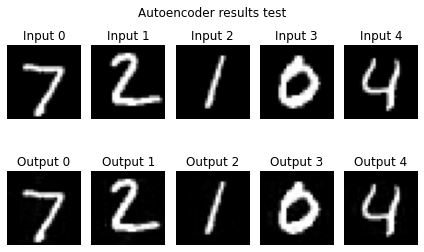

**update**, 
 moved to: [https://github.com/sradc/nd-mlp-mixer](nd-mlp-https://github.com/sradc/nd-mlp-mixer)

# Patchless MLP-Mixer

This is a preliminary exploration of an even simpler [MLP-Mixer](https://arxiv.org/abs/2105.01601) style architecture.

This architecture:
- Uses image rows and columns directly, instead of [image patches -> tokens].
- Uses a (novel?) classification method, heavily inspired by MLP-Mixer.
- Enables models to be deep.
- Has a low parameter count, for relatively large images and depths.

It looks fairly promising (warrenting further investigation):
- Initial results (on MNIST and CIFAR-10) are good.
- The model is capable of overfitting MNIST and CIFAR-10, suggesting that it might do well with larger, more varied datasets.

Would also be interesting to see how well it works for saliency, object localization, etc, since output has same dimension as input.

Discussion of CIFAR-10 results:
The model is trained from scratch on CIFAR-10, 
and does worse than a CNN of similar parameter size would do.
However, the architecture is less biased than a CNN, 
so I hypothesize that it will work well
if first pre-trained on much larger datasets (which was also the case for Mixer-MLP).

I'm not currently set-up (in terms of hardware/VMs) to train on ImageNet size datasets, so watch this space.

## Patchless MLP-Mixer layer


The above is a single patchless MLP-Mixer stye layer. 
Note that the implementation multiplies the output representation by a learnable scalar,
initialised to 0,
before adding the input image to it,
meaning that the function before training is the identity function
(this isn't shown on the diagram).
The number of these layers to use is a hyperparameter to be tuned.

# Row-Column representation classifier


Note that MLP1 and MLP2 are unique networks, different from each other, (and not the same as the ones in the previous diagram).

---

```python
import matplotlib.pyplot as plt
import numpy as np
import tensorflow as tf
from tensorflow.keras import datasets, layers
```


```python
def lin_on_axis(X, weights, bias=0, axis=-1):
    "Apply a linear layer to a particular axis in an n-dimensional array."
    # (I found einsum slightly faster than [transpose->matmul->transpose])

    A = 'abcdefghijklmnopqrstuvwxyz'
    
    ndim = len(X.shape)
    assert ndim <= len(A), 'Too many dimensions.'

    axis = axis if axis >= 0 else ndim + axis
    assert axis >= 0 and axis < ndim, f'Invalid axis: {axis}, for ndim: {ndim}'

    s1 = ''.join(A[i] for i in range(ndim))
    s2 = ''.join(s1[axis] + A[ndim])
    s3 = ''.join(A[i] if i != axis else A[ndim] for i in range(ndim))

    if tf.is_tensor(bias):
        bias_shape = [1 if i != axis else bias.shape[0] for i in range(ndim)]
        bias = tf.reshape(bias, bias_shape)
    
    return tf.einsum(f'{s1},{s2}->{s3}', X, weights, optimize='auto') + bias

class DenseOnAxis(layers.Layer):
    "Dense layer that is applied to a particular axis of an ndarray."

    def __init__(self, units, axis=-1, activation=lambda x: x):
        super().__init__()
        self.units = units
        self.axis = axis
        self.activation = activation

    def build(self, input_shape):
        self.w = self.add_weight(shape=[input_shape[self.axis], self.units],
                                initializer='he_uniform',
                                trainable=True)
        self.b = self.add_weight(shape=[self.units],
                                initializer='zeros',
                                trainable=True)

    def call(self, inputs):
        h = lin_on_axis(inputs, self.w, self.b, self.axis)
        return self.activation(h)

class MLPOnAxis(layers.Layer):
    "Multilayer perceptron that is applied to a particular axis of an ndarray."

    def __init__(self, outsize, axis=-1, hidden_size=None, activation=tf.nn.gelu):
        super().__init__()
        hidden_size = hidden_size if hidden_size else outsize
        self.layer_1 = DenseOnAxis(hidden_size, axis, activation)
        self.layer_2 = DenseOnAxis(outsize, axis)

    def call(self, inputs):
        h = self.layer_1(inputs)
        return self.layer_2(h)

class NdMixer(layers.Layer):
    "N-dimensional MLP-mixer, without batchnorm or skip connections."

    def __init__(self, outshape, Net=MLPOnAxis, gate=True):
        """ 
        Args:
            outshape (tuple/list):
                The output shape, not including the samples dimension.
            Net (layers.Layer):
                A dense-like layer, that operates on a particular axis.
            gate (bool):
                Whether to gate the output (with a learnable scalar),
                in order to initialise as the identify function. 
        """
        super().__init__()
        self.ndim = len(outshape)
        self.nets = [Net(size, axis=i+1) for i, size in enumerate(outshape)] 
        self.gate = ScalarGate() if gate else lambda x: x

    def call(self, inputs):
        h = inputs
        for net in self.nets:
            h = net(h)
        return self.gate(h)

class Layers(layers.Layer):
    def __init__(self, num_layers, make_layer):
        super().__init__()
        self.layers = [make_layer() for _ in range(num_layers)]
    
    def call(self, inputs):
        h = inputs
        for layer in self.layers:
            h = layer(h)
        return h

class ResidualLayers(layers.Layer):
    def __init__(self, num_layers, make_layer):
        super().__init__()
        self.layers = [make_layer() for _ in range(num_layers)]

    def call(self, inputs):  # momentum ResNets
        h = inputs
        for layer in self.layers:
            h = h + layer(h)
        return h

class ScalarGate(layers.Layer):
    def __init__(self):
        super().__init__()
        self.value = tf.Variable(0.0, trainable=True)

    def call(self, inputs):
        return self.value * inputs
    
```


```python
def MixerClf(in_shape, repr_shape, out_shape, num_mix_layers, hidden_size=None):
    Net = lambda outsize, axis: MLPOnAxis(outsize, axis, hidden_size)
    make_mixer = lambda: NdMixer(repr_shape, Net, gate=True)

    inputs = layers.Input(in_shape)
    repr_init = NdMixer(repr_shape, Net=DenseOnAxis, gate=False)(inputs)
    mixed = ResidualLayers(num_mix_layers, make_mixer)(repr_init)
    repr_final = NdMixer(out_shape, Net=DenseOnAxis, gate=False)(mixed)
    h = layers.Flatten()(repr_final)
    h = layers.Dense(num_classes)(h)
    return tf.keras.Model(inputs=inputs, outputs=h)


def MixerAutoencoder(in_shape, repr_shape, num_mix_layers, hidden_size=None):
    Net = lambda outsize, axis: MLPOnAxis(outsize, axis, hidden_size)
    make_mixer = lambda: NdMixer(repr_shape, Net, gate=True)

    inputs = layers.Input(in_shape)
    repr_init = NdMixer(repr_shape, Net=Net, gate=False)(inputs)
    mixed = ResidualLayers(num_mix_layers, make_mixer)(repr_init)
    repr_final = NdMixer(in_shape, Net=Net, gate=False)(mixed)
    return tf.keras.Model(inputs=inputs, outputs=repr_final)

```

# MNIST


```python
(train_images, train_labels), (test_images, test_labels) = datasets.mnist.load_data()
train_images, test_images = train_images / 255.0, test_images / 255.0
train_images, test_images = train_images.astype(np.float32), test_images.astype(np.float32)

height, width = train_images.shape[-2:]
num_classes = 10
```

    Downloading data from https://storage.googleapis.com/tensorflow/tf-keras-datasets/mnist.npz
    11493376/11490434 [==============================] - 0s 0us/step


```python
# Assert that the model is initialised as identify function.
num_mix_layers = 16
make_mixer = lambda: NdMixer([height, width], MLPOnAxis, gate=True)
inputs = tf.keras.layers.Input(shape=(height, width))
mixer_layers = ResidualLayers(num_mix_layers, make_mixer)(inputs)
model = tf.keras.Model(inputs=inputs, outputs=mixer_layers)
assert np.sum(model.predict(train_images[0:100, ...]) - train_images[0:100, ...]) == 0
```

## Autoencoder


```python
num_mix_layers = 4
in_shape = (height, width)
repr_shape = (height, width)

model = MixerAutoencoder(in_shape, repr_shape, num_mix_layers)

print(model.summary())
model.compile(optimizer='adam',
              loss='mse',
              metrics=[tf.keras.metrics.RootMeanSquaredError()])
history = model.fit(train_images, train_images, batch_size=64, epochs=10, 
                    validation_data=(test_images, test_images), verbose=2)

# PLOTS
plt.plot(history.history['root_mean_squared_error'], label='root_mean_squared_error')
plt.plot(history.history['val_root_mean_squared_error'], label = 'val_root_mean_squared_error')
plt.xlabel('Epoch')
plt.ylabel('RMSE')
plt.ylim([0, .2])
plt.legend()
test_loss, test_acc = model.evaluate(test_images,  test_images, verbose=2)

for i in range(5):
    im = train_images[i:i+1,...]

    plt.subplot(2, 5, i+1)
    plt.imshow(im[0,...], cmap='gray', vmin=0, vmax=1)
    plt.axis('off')
    plt.title(f'Input {i}')

    plt.subplot(2, 5, i+6)
    plt.imshow(model.predict(im)[0,...], cmap='gray', vmin=0, vmax=1)
    plt.axis('off')
    plt.title(f'Output {i}')

plt.suptitle("Autoencoder results train")
plt.tight_layout()
plt.show()

for i in range(5):
    im = test_images[i:i+1,...]

    plt.subplot(2, 5, i+1)
    plt.imshow(im[0,...], cmap='gray', vmin=0, vmax=1)
    plt.axis('off')
    plt.title(f'Input {i}')

    plt.subplot(2, 5, i+6)
    plt.imshow(model.predict(im)[0,...], cmap='gray', vmin=0, vmax=1)
    plt.axis('off')
    plt.title(f'Output {i}')

plt.suptitle("Autoencoder results test")
plt.tight_layout()
plt.show()
```

    Model: "model_14"
    _________________________________________________________________
    Layer (type)                 Output Shape              Param #   
    =================================================================
    input_14 (InputLayer)        [(None, 28, 28)]          0         
    _________________________________________________________________
    mlp_on_axis_140 (MLPOnAxis)  (None, 28, 28)            1624      
    _________________________________________________________________
    mlp_on_axis_141 (MLPOnAxis)  (None, 28, 28)            1624      
    _________________________________________________________________
    residual_layers_12 (Residual (None, 28, 28)            12996     
    _________________________________________________________________
    mlp_on_axis_150 (MLPOnAxis)  (None, 28, 28)            1624      
    _________________________________________________________________
    mlp_on_axis_151 (MLPOnAxis)  (None, 28, 28)            1624      
    =================================================================
    Total params: 19,492
    Trainable params: 19,492
    Non-trainable params: 0
    _________________________________________________________________
    None
    Epoch 1/10
    938/938 - 7s - loss: 0.0538 - root_mean_squared_error: 0.2319 - val_loss: 0.0150 - val_root_mean_squared_error: 0.1226
    Epoch 2/10
    938/938 - 4s - loss: 0.0100 - root_mean_squared_error: 0.1000 - val_loss: 0.0065 - val_root_mean_squared_error: 0.0809
    Epoch 3/10
    938/938 - 5s - loss: 0.0050 - root_mean_squared_error: 0.0710 - val_loss: 0.0037 - val_root_mean_squared_error: 0.0604
    Epoch 4/10
    938/938 - 5s - loss: 0.0029 - root_mean_squared_error: 0.0535 - val_loss: 0.0021 - val_root_mean_squared_error: 0.0462
    Epoch 5/10
    938/938 - 4s - loss: 0.0018 - root_mean_squared_error: 0.0423 - val_loss: 0.0015 - val_root_mean_squared_error: 0.0385
    Epoch 6/10
    938/938 - 5s - loss: 0.0013 - root_mean_squared_error: 0.0367 - val_loss: 0.0012 - val_root_mean_squared_error: 0.0341
    Epoch 7/10
    938/938 - 4s - loss: 9.7581e-04 - root_mean_squared_error: 0.0312 - val_loss: 7.4066e-04 - val_root_mean_squared_error: 0.0272
    Epoch 8/10
    938/938 - 4s - loss: 6.8301e-04 - root_mean_squared_error: 0.0261 - val_loss: 5.9962e-04 - val_root_mean_squared_error: 0.0245
    Epoch 9/10
    938/938 - 4s - loss: 5.7733e-04 - root_mean_squared_error: 0.0240 - val_loss: 5.0776e-04 - val_root_mean_squared_error: 0.0225
    Epoch 10/10
    938/938 - 4s - loss: 4.7308e-04 - root_mean_squared_error: 0.0218 - val_loss: 4.0292e-04 - val_root_mean_squared_error: 0.0201
    313/313 - 1s - loss: 4.0292e-04 - root_mean_squared_error: 0.0201


    

    


    

    


```python
"Using a much smaller hidden representation, but larger hidden size."

num_mix_layers = 4
in_shape = (height, width)
repr_shape = (4, 4)

model = MixerAutoencoder(in_shape, repr_shape, num_mix_layers, hidden_size=256)

print(model.summary())
model.compile(optimizer='adam',
              loss='mse',
              metrics=[tf.keras.metrics.RootMeanSquaredError()])
history = model.fit(train_images, train_images, batch_size=64, epochs=10, 
                    validation_data=(test_images, test_images), verbose=2)

# PLOTS
plt.plot(history.history['root_mean_squared_error'], label='root_mean_squared_error')
plt.plot(history.history['val_root_mean_squared_error'], label = 'val_root_mean_squared_error')
plt.xlabel('Epoch')
plt.ylabel('RMSE')
plt.ylim([0, .2])
plt.legend()
test_loss, test_acc = model.evaluate(test_images,  test_images, verbose=2)

for i in range(5):
    im = train_images[i:i+1,...]

    plt.subplot(2, 5, i+1)
    plt.imshow(im[0,...], cmap='gray', vmin=0, vmax=1)
    plt.axis('off')
    plt.title(f'Input {i}')

    plt.subplot(2, 5, i+6)
    plt.imshow(model.predict(im)[0,...], cmap='gray', vmin=0, vmax=1)
    plt.axis('off')
    plt.title(f'Output {i}')

plt.suptitle("Autoencoder results train")
plt.tight_layout()
plt.show()

for i in range(5):
    im = test_images[i:i+1,...]

    plt.subplot(2, 5, i+1)
    plt.imshow(im[0,...], cmap='gray', vmin=0, vmax=1)
    plt.axis('off')
    plt.title(f'Input {i}')

    plt.subplot(2, 5, i+6)
    plt.imshow(model.predict(im)[0,...], cmap='gray', vmin=0, vmax=1)
    plt.axis('off')
    plt.title(f'Output {i}')

plt.suptitle("Autoencoder results test")
plt.tight_layout()
plt.show()
```

    Model: "model_15"
    _________________________________________________________________
    Layer (type)                 Output Shape              Param #   
    =================================================================
    input_15 (InputLayer)        [(None, 28, 28)]          0         
    _________________________________________________________________
    mlp_on_axis_152 (MLPOnAxis)  (None, 4, 28)             8452      
    _________________________________________________________________
    mlp_on_axis_153 (MLPOnAxis)  (None, 4, 4)              8452      
    _________________________________________________________________
    residual_layers_13 (Residual (None, 4, 4)              18468     
    _________________________________________________________________
    mlp_on_axis_162 (MLPOnAxis)  (None, 28, 4)             8476      
    _________________________________________________________________
    mlp_on_axis_163 (MLPOnAxis)  (None, 28, 28)            8476      
    =================================================================
    Total params: 52,324
    Trainable params: 52,324
    Non-trainable params: 0
    _________________________________________________________________
    None
    Epoch 1/10
    938/938 - 7s - loss: 0.0382 - root_mean_squared_error: 0.1953 - val_loss: 0.0280 - val_root_mean_squared_error: 0.1672
    Epoch 2/10
    938/938 - 5s - loss: 0.0262 - root_mean_squared_error: 0.1617 - val_loss: 0.0239 - val_root_mean_squared_error: 0.1546
    Epoch 3/10
    938/938 - 5s - loss: 0.0232 - root_mean_squared_error: 0.1523 - val_loss: 0.0220 - val_root_mean_squared_error: 0.1483
    Epoch 4/10
    938/938 - 4s - loss: 0.0220 - root_mean_squared_error: 0.1482 - val_loss: 0.0213 - val_root_mean_squared_error: 0.1459
    Epoch 5/10
    938/938 - 4s - loss: 0.0212 - root_mean_squared_error: 0.1456 - val_loss: 0.0207 - val_root_mean_squared_error: 0.1439
    Epoch 6/10
    938/938 - 5s - loss: 0.0206 - root_mean_squared_error: 0.1437 - val_loss: 0.0201 - val_root_mean_squared_error: 0.1416
    Epoch 7/10
    938/938 - 5s - loss: 0.0202 - root_mean_squared_error: 0.1423 - val_loss: 0.0197 - val_root_mean_squared_error: 0.1403
    Epoch 8/10
    938/938 - 4s - loss: 0.0199 - root_mean_squared_error: 0.1410 - val_loss: 0.0193 - val_root_mean_squared_error: 0.1389
    Epoch 9/10
    938/938 - 5s - loss: 0.0196 - root_mean_squared_error: 0.1400 - val_loss: 0.0192 - val_root_mean_squared_error: 0.1387
    Epoch 10/10
    938/938 - 4s - loss: 0.0194 - root_mean_squared_error: 0.1392 - val_loss: 0.0189 - val_root_mean_squared_error: 0.1376
    313/313 - 1s - loss: 0.0189 - root_mean_squared_error: 0.1376


    

    


    

    


```python
"Less small hidden representation, small hidden size."

num_mix_layers = 4
in_shape = (height, width)
repr_shape = (8, 8)

model = MixerAutoencoder(in_shape, repr_shape, num_mix_layers, hidden_size=None)

print(model.summary())
model.compile(optimizer='adam',
              loss='mse',
              metrics=[tf.keras.metrics.RootMeanSquaredError()])
history = model.fit(train_images, train_images, batch_size=64, epochs=10, 
                    validation_data=(test_images, test_images), verbose=2)

# PLOTS
plt.plot(history.history['root_mean_squared_error'], label='root_mean_squared_error')
plt.plot(history.history['val_root_mean_squared_error'], label = 'val_root_mean_squared_error')
plt.xlabel('Epoch')
plt.ylabel('RMSE')
plt.ylim([0, .2])
plt.legend()
test_loss, test_acc = model.evaluate(test_images,  test_images, verbose=2)

for i in range(5):
    im = train_images[i:i+1,...]

    plt.subplot(2, 5, i+1)
    plt.imshow(im[0,...], cmap='gray', vmin=0, vmax=1)
    plt.axis('off')
    plt.title(f'Input {i}')

    plt.subplot(2, 5, i+6)
    plt.imshow(model.predict(im)[0,...], cmap='gray', vmin=0, vmax=1)
    plt.axis('off')
    plt.title(f'Output {i}')

plt.suptitle("Autoencoder results train")
plt.tight_layout()
plt.show()

for i in range(5):
    im = test_images[i:i+1,...]

    plt.subplot(2, 5, i+1)
    plt.imshow(im[0,...], cmap='gray', vmin=0, vmax=1)
    plt.axis('off')
    plt.title(f'Input {i}')

    plt.subplot(2, 5, i+6)
    plt.imshow(model.predict(im)[0,...], cmap='gray', vmin=0, vmax=1)
    plt.axis('off')
    plt.title(f'Output {i}')

plt.suptitle("Autoencoder results test")
plt.tight_layout()
plt.show()
```

    Model: "model_17"
    _________________________________________________________________
    Layer (type)                 Output Shape              Param #   
    =================================================================
    input_17 (InputLayer)        [(None, 28, 28)]          0         
    _________________________________________________________________
    mlp_on_axis_184 (MLPOnAxis)  (None, 8, 28)             304       
    _________________________________________________________________
    mlp_on_axis_185 (MLPOnAxis)  (None, 8, 8)              304       
    _________________________________________________________________
    residual_layers_15 (Residual (None, 8, 8)              1156      
    _________________________________________________________________
    mlp_on_axis_194 (MLPOnAxis)  (None, 28, 8)             1064      
    _________________________________________________________________
    mlp_on_axis_195 (MLPOnAxis)  (None, 28, 28)            1064      
    =================================================================
    Total params: 3,892
    Trainable params: 3,892
    Non-trainable params: 0
    _________________________________________________________________
    None
    Epoch 1/10
    938/938 - 7s - loss: 0.0729 - root_mean_squared_error: 0.2700 - val_loss: 0.0460 - val_root_mean_squared_error: 0.2146
    Epoch 2/10
    938/938 - 5s - loss: 0.0332 - root_mean_squared_error: 0.1823 - val_loss: 0.0246 - val_root_mean_squared_error: 0.1569
    Epoch 3/10
    938/938 - 4s - loss: 0.0219 - root_mean_squared_error: 0.1479 - val_loss: 0.0183 - val_root_mean_squared_error: 0.1355
    Epoch 4/10
    938/938 - 4s - loss: 0.0161 - root_mean_squared_error: 0.1269 - val_loss: 0.0136 - val_root_mean_squared_error: 0.1168
    Epoch 5/10
    938/938 - 4s - loss: 0.0130 - root_mean_squared_error: 0.1140 - val_loss: 0.0119 - val_root_mean_squared_error: 0.1090
    Epoch 6/10
    938/938 - 4s - loss: 0.0115 - root_mean_squared_error: 0.1073 - val_loss: 0.0105 - val_root_mean_squared_error: 0.1026
    Epoch 7/10
    938/938 - 5s - loss: 0.0103 - root_mean_squared_error: 0.1015 - val_loss: 0.0095 - val_root_mean_squared_error: 0.0977
    Epoch 8/10
    938/938 - 4s - loss: 0.0095 - root_mean_squared_error: 0.0977 - val_loss: 0.0089 - val_root_mean_squared_error: 0.0945
    Epoch 9/10
    938/938 - 4s - loss: 0.0090 - root_mean_squared_error: 0.0949 - val_loss: 0.0085 - val_root_mean_squared_error: 0.0923
    Epoch 10/10
    938/938 - 4s - loss: 0.0086 - root_mean_squared_error: 0.0929 - val_loss: 0.0082 - val_root_mean_squared_error: 0.0907
    313/313 - 1s - loss: 0.0082 - root_mean_squared_error: 0.0907


    

    


    

    


## Classifier


```python
"Train a small mixer on MNIST."

num_mix_layers = 4
in_shape = (height, width)
repr_shape = (height, width)
out_shape = (1, 28)

model = MixerClf(in_shape, repr_shape, out_shape, num_mix_layers)

print(model.summary())
model.compile(optimizer='adam',
              loss=tf.keras.losses.SparseCategoricalCrossentropy(from_logits=True),
              metrics=['accuracy'])
history = model.fit(train_images, train_labels, batch_size=64, epochs=10, 
                    validation_data=(test_images, test_labels), verbose=2)

# PLOTS
plt.plot(history.history['accuracy'], label='accuracy')
plt.plot(history.history['val_accuracy'], label = 'val_accuracy')
plt.xlabel('Epoch')
plt.ylabel('Accuracy')
plt.ylim([.5, 1])
plt.legend(loc='lower right')
plt.show()
```

    Model: "model_18"
    _________________________________________________________________
    Layer (type)                 Output Shape              Param #   
    =================================================================
    input_18 (InputLayer)        [(None, 28, 28)]          0         
    _________________________________________________________________
    dense_on_axis_430 (DenseOnAx (None, 28, 28)            812       
    _________________________________________________________________
    dense_on_axis_431 (DenseOnAx (None, 28, 28)            812       
    _________________________________________________________________
    residual_layers_16 (Residual (None, 28, 28)            12996     
    _________________________________________________________________
    dense_on_axis_448 (DenseOnAx (None, 1, 28)             29        
    _________________________________________________________________
    dense_on_axis_449 (DenseOnAx (None, 1, 28)             812       
    _________________________________________________________________
    flatten_5 (Flatten)          (None, 28)                0         
    _________________________________________________________________
    dense_5 (Dense)              (None, 10)                290       
    =================================================================
    Total params: 15,751
    Trainable params: 15,751
    Non-trainable params: 0
    _________________________________________________________________
    None
    Epoch 1/10
    938/938 - 6s - loss: 0.4371 - accuracy: 0.8632 - val_loss: 0.1879 - val_accuracy: 0.9426
    Epoch 2/10
    938/938 - 4s - loss: 0.1590 - accuracy: 0.9512 - val_loss: 0.1374 - val_accuracy: 0.9586
    Epoch 3/10
    938/938 - 4s - loss: 0.1191 - accuracy: 0.9638 - val_loss: 0.1157 - val_accuracy: 0.9658
    Epoch 4/10
    938/938 - 4s - loss: 0.0998 - accuracy: 0.9693 - val_loss: 0.1069 - val_accuracy: 0.9670
    Epoch 5/10
    938/938 - 4s - loss: 0.0847 - accuracy: 0.9733 - val_loss: 0.1060 - val_accuracy: 0.9689
    Epoch 6/10
    938/938 - 4s - loss: 0.0742 - accuracy: 0.9762 - val_loss: 0.0867 - val_accuracy: 0.9720
    Epoch 7/10
    938/938 - 4s - loss: 0.0665 - accuracy: 0.9793 - val_loss: 0.0895 - val_accuracy: 0.9748
    Epoch 8/10
    938/938 - 4s - loss: 0.0600 - accuracy: 0.9809 - val_loss: 0.0931 - val_accuracy: 0.9724
    Epoch 9/10
    938/938 - 4s - loss: 0.0536 - accuracy: 0.9826 - val_loss: 0.0847 - val_accuracy: 0.9743
    Epoch 10/10
    938/938 - 4s - loss: 0.0489 - accuracy: 0.9839 - val_loss: 0.0815 - val_accuracy: 0.9758


    

    


```python
"Playing with the dimensionality (with larger hidden size)."

num_mix_layers = 4
in_shape = (1, height, width)
repr_shape = (8, 8, 8)
out_shape = (28, 1, 1)

inputs = layers.Input((height, width))
h = layers.Reshape(in_shape)(inputs)
h = MixerClf(in_shape, repr_shape, out_shape, num_mix_layers, hidden_size=64)(h)
model = tf.keras.Model(inputs=inputs, outputs=h)

print(model.summary())
model.compile(optimizer='adam',
              loss=tf.keras.losses.SparseCategoricalCrossentropy(from_logits=True),
              metrics=['accuracy'])
history = model.fit(train_images, train_labels, batch_size=64, epochs=10, 
                    validation_data=(test_images, test_labels), verbose=2)

# PLOTS
plt.plot(history.history['accuracy'], label='accuracy')
plt.plot(history.history['val_accuracy'], label = 'val_accuracy')
plt.xlabel('Epoch')
plt.ylabel('Accuracy')
plt.ylim([.5, 1])
plt.legend(loc='lower right')
plt.show()
```

    Model: "model_20"
    _________________________________________________________________
    Layer (type)                 Output Shape              Param #   
    =================================================================
    input_19 (InputLayer)        [(None, 28, 28)]          0         
    _________________________________________________________________
    reshape_1 (Reshape)          (None, 1, 28, 28)         0         
    _________________________________________________________________
    model_19 (Functional)        (None, 10)                14196     
    =================================================================
    Total params: 14,196
    Trainable params: 14,196
    Non-trainable params: 0
    _________________________________________________________________
    None
    Epoch 1/10
    938/938 - 10s - loss: 0.5841 - accuracy: 0.8112 - val_loss: 0.2524 - val_accuracy: 0.9210
    Epoch 2/10
    938/938 - 7s - loss: 0.2264 - accuracy: 0.9312 - val_loss: 0.2253 - val_accuracy: 0.9273
    Epoch 3/10
    938/938 - 7s - loss: 0.1764 - accuracy: 0.9463 - val_loss: 0.1663 - val_accuracy: 0.9479
    Epoch 4/10
    938/938 - 7s - loss: 0.1473 - accuracy: 0.9546 - val_loss: 0.1582 - val_accuracy: 0.9517
    Epoch 5/10
    938/938 - 7s - loss: 0.1347 - accuracy: 0.9582 - val_loss: 0.1534 - val_accuracy: 0.9529
    Epoch 6/10
    938/938 - 7s - loss: 0.1217 - accuracy: 0.9623 - val_loss: 0.1387 - val_accuracy: 0.9579
    Epoch 7/10
    938/938 - 7s - loss: 0.1139 - accuracy: 0.9653 - val_loss: 0.1196 - val_accuracy: 0.9630
    Epoch 8/10
    938/938 - 7s - loss: 0.1073 - accuracy: 0.9671 - val_loss: 0.1199 - val_accuracy: 0.9626
    Epoch 9/10
    938/938 - 7s - loss: 0.1010 - accuracy: 0.9679 - val_loss: 0.1205 - val_accuracy: 0.9624
    Epoch 10/10
    938/938 - 7s - loss: 0.0967 - accuracy: 0.9699 - val_loss: 0.1141 - val_accuracy: 0.9649


    

    


```python
"Using a smaller representation size."

num_mix_layers = 4
in_shape = (height, width)
repr_shape = (4, 4)
out_shape = (4, 4)

model = MixerClf(in_shape, repr_shape, out_shape, num_mix_layers)

print(model.summary())
model.compile(optimizer='adam',
              loss=tf.keras.losses.SparseCategoricalCrossentropy(from_logits=True),
              metrics=['accuracy'])
history = model.fit(train_images, train_labels, batch_size=64, epochs=10, 
                    validation_data=(test_images, test_labels), verbose=2)

# PLOTS
plt.plot(history.history['accuracy'], label='accuracy')
plt.plot(history.history['val_accuracy'], label = 'val_accuracy')
plt.xlabel('Epoch')
plt.ylabel('Accuracy')
plt.ylim([.5, 1])
plt.legend(loc='lower right')
plt.show()
```

    Model: "model_21"
    _________________________________________________________________
    Layer (type)                 Output Shape              Param #   
    =================================================================
    input_21 (InputLayer)        [(None, 28, 28)]          0         
    _________________________________________________________________
    dense_on_axis_480 (DenseOnAx (None, 4, 28)             116       
    _________________________________________________________________
    dense_on_axis_481 (DenseOnAx (None, 4, 4)              116       
    _________________________________________________________________
    residual_layers_18 (Residual (None, 4, 4)              324       
    _________________________________________________________________
    dense_on_axis_498 (DenseOnAx (None, 4, 4)              20        
    _________________________________________________________________
    dense_on_axis_499 (DenseOnAx (None, 4, 4)              20        
    _________________________________________________________________
    flatten_7 (Flatten)          (None, 16)                0         
    _________________________________________________________________
    dense_7 (Dense)              (None, 10)                170       
    =================================================================
    Total params: 766
    Trainable params: 766
    Non-trainable params: 0
    _________________________________________________________________
    None
    Epoch 1/10
    938/938 - 6s - loss: 1.1007 - accuracy: 0.6382 - val_loss: 0.6482 - val_accuracy: 0.8064
    Epoch 2/10
    938/938 - 4s - loss: 0.5687 - accuracy: 0.8292 - val_loss: 0.4519 - val_accuracy: 0.8683
    Epoch 3/10
    938/938 - 4s - loss: 0.4427 - accuracy: 0.8701 - val_loss: 0.3712 - val_accuracy: 0.8937
    Epoch 4/10
    938/938 - 4s - loss: 0.3823 - accuracy: 0.8860 - val_loss: 0.3304 - val_accuracy: 0.9035
    Epoch 5/10
    938/938 - 4s - loss: 0.3478 - accuracy: 0.8970 - val_loss: 0.3107 - val_accuracy: 0.9105
    Epoch 6/10
    938/938 - 4s - loss: 0.3277 - accuracy: 0.9026 - val_loss: 0.3029 - val_accuracy: 0.9127
    Epoch 7/10
    938/938 - 4s - loss: 0.3124 - accuracy: 0.9072 - val_loss: 0.2848 - val_accuracy: 0.9168
    Epoch 8/10
    938/938 - 4s - loss: 0.3015 - accuracy: 0.9101 - val_loss: 0.2849 - val_accuracy: 0.9169
    Epoch 9/10
    938/938 - 4s - loss: 0.2911 - accuracy: 0.9133 - val_loss: 0.2756 - val_accuracy: 0.9225
    Epoch 10/10
    938/938 - 4s - loss: 0.2832 - accuracy: 0.9168 - val_loss: 0.2744 - val_accuracy: 0.9191


    

    


```python
"Using a larger representation size."

num_mix_layers = 4
in_shape = (height, width)
repr_shape = (64, 64)
out_shape = (1, 12)

model = MixerClf(in_shape, repr_shape, out_shape, num_mix_layers)

print(model.summary())
model.compile(optimizer='adam',
              loss=tf.keras.losses.SparseCategoricalCrossentropy(from_logits=True),
              metrics=['accuracy'])
history = model.fit(train_images, train_labels, batch_size=64, epochs=10, 
                    validation_data=(test_images, test_labels), verbose=2)

# PLOTS
plt.plot(history.history['accuracy'], label='accuracy')
plt.plot(history.history['val_accuracy'], label = 'val_accuracy')
plt.xlabel('Epoch')
plt.ylabel('Accuracy')
plt.ylim([.5, 1])
plt.legend(loc='lower right')
plt.show()
```

    Model: "model_22"
    _________________________________________________________________
    Layer (type)                 Output Shape              Param #   
    =================================================================
    input_22 (InputLayer)        [(None, 28, 28)]          0         
    _________________________________________________________________
    dense_on_axis_500 (DenseOnAx (None, 64, 28)            1856      
    _________________________________________________________________
    dense_on_axis_501 (DenseOnAx (None, 64, 64)            1856      
    _________________________________________________________________
    residual_layers_19 (Residual (None, 64, 64)            66564     
    _________________________________________________________________
    dense_on_axis_518 (DenseOnAx (None, 1, 64)             65        
    _________________________________________________________________
    dense_on_axis_519 (DenseOnAx (None, 1, 12)             780       
    _________________________________________________________________
    flatten_8 (Flatten)          (None, 12)                0         
    _________________________________________________________________
    dense_8 (Dense)              (None, 10)                130       
    =================================================================
    Total params: 71,251
    Trainable params: 71,251
    Non-trainable params: 0
    _________________________________________________________________
    None
    Epoch 1/10
    938/938 - 8s - loss: 0.3263 - accuracy: 0.8987 - val_loss: 0.1381 - val_accuracy: 0.9608
    Epoch 2/10
    938/938 - 5s - loss: 0.1124 - accuracy: 0.9666 - val_loss: 0.1120 - val_accuracy: 0.9642
    Epoch 3/10
    938/938 - 5s - loss: 0.0784 - accuracy: 0.9755 - val_loss: 0.0767 - val_accuracy: 0.9756
    Epoch 4/10
    938/938 - 5s - loss: 0.0605 - accuracy: 0.9815 - val_loss: 0.0894 - val_accuracy: 0.9715
    Epoch 5/10
    938/938 - 5s - loss: 0.0462 - accuracy: 0.9851 - val_loss: 0.0674 - val_accuracy: 0.9777
    Epoch 6/10
    938/938 - 5s - loss: 0.0401 - accuracy: 0.9867 - val_loss: 0.0672 - val_accuracy: 0.9791
    Epoch 7/10
    938/938 - 5s - loss: 0.0307 - accuracy: 0.9901 - val_loss: 0.0711 - val_accuracy: 0.9787
    Epoch 8/10
    938/938 - 5s - loss: 0.0285 - accuracy: 0.9908 - val_loss: 0.0630 - val_accuracy: 0.9825
    Epoch 9/10
    938/938 - 5s - loss: 0.0229 - accuracy: 0.9927 - val_loss: 0.0792 - val_accuracy: 0.9795
    Epoch 10/10
    938/938 - 5s - loss: 0.0224 - accuracy: 0.9926 - val_loss: 0.0858 - val_accuracy: 0.9779


    

    


```python
"Using a smaller representation size, but larger hidden layer size."

num_mix_layers = 4
in_shape = (height, width)
repr_shape = (4, 4)
out_shape = (4, 4)

model = MixerClf(in_shape, repr_shape, out_shape, num_mix_layers, hidden_size=512)

print(model.summary())
model.compile(optimizer='adam',
              loss=tf.keras.losses.SparseCategoricalCrossentropy(from_logits=True),
              metrics=['accuracy'])
history = model.fit(train_images, train_labels, batch_size=64, epochs=10, 
                    validation_data=(test_images, test_labels), verbose=2)

# PLOTS
plt.plot(history.history['accuracy'], label='accuracy')
plt.plot(history.history['val_accuracy'], label = 'val_accuracy')
plt.xlabel('Epoch')
plt.ylabel('Accuracy')
plt.ylim([.5, 1])
plt.legend(loc='lower right')
plt.show()
```

    Model: "model_23"
    _________________________________________________________________
    Layer (type)                 Output Shape              Param #   
    =================================================================
    input_23 (InputLayer)        [(None, 28, 28)]          0         
    _________________________________________________________________
    dense_on_axis_520 (DenseOnAx (None, 4, 28)             116       
    _________________________________________________________________
    dense_on_axis_521 (DenseOnAx (None, 4, 4)              116       
    _________________________________________________________________
    residual_layers_20 (Residual (None, 4, 4)              36900     
    _________________________________________________________________
    dense_on_axis_538 (DenseOnAx (None, 4, 4)              20        
    _________________________________________________________________
    dense_on_axis_539 (DenseOnAx (None, 4, 4)              20        
    _________________________________________________________________
    flatten_9 (Flatten)          (None, 16)                0         
    _________________________________________________________________
    dense_9 (Dense)              (None, 10)                170       
    =================================================================
    Total params: 37,342
    Trainable params: 37,342
    Non-trainable params: 0
    _________________________________________________________________
    None
    Epoch 1/10
    938/938 - 6s - loss: 0.7430 - accuracy: 0.7595 - val_loss: 0.3957 - val_accuracy: 0.8761
    Epoch 2/10
    938/938 - 4s - loss: 0.3703 - accuracy: 0.8862 - val_loss: 0.3244 - val_accuracy: 0.9022
    Epoch 3/10
    938/938 - 4s - loss: 0.3103 - accuracy: 0.9051 - val_loss: 0.2896 - val_accuracy: 0.9098
    Epoch 4/10
    938/938 - 4s - loss: 0.2759 - accuracy: 0.9149 - val_loss: 0.2598 - val_accuracy: 0.9225
    Epoch 5/10
    938/938 - 4s - loss: 0.2534 - accuracy: 0.9227 - val_loss: 0.2463 - val_accuracy: 0.9254
    Epoch 6/10
    938/938 - 4s - loss: 0.2404 - accuracy: 0.9273 - val_loss: 0.2193 - val_accuracy: 0.9352
    Epoch 7/10
    938/938 - 4s - loss: 0.2263 - accuracy: 0.9297 - val_loss: 0.2266 - val_accuracy: 0.9298
    Epoch 8/10
    938/938 - 4s - loss: 0.2190 - accuracy: 0.9326 - val_loss: 0.2121 - val_accuracy: 0.9353
    Epoch 9/10
    938/938 - 4s - loss: 0.2098 - accuracy: 0.9359 - val_loss: 0.1990 - val_accuracy: 0.9417
    Epoch 10/10
    938/938 - 4s - loss: 0.2065 - accuracy: 0.9374 - val_loss: 0.2072 - val_accuracy: 0.9390


    

    


```python
mixfunc = tf.keras.backend.function([model.layers[0].input], [model.layers[3].output])

plt.figure(figsize=(5, 16))
for i in range(20):
    im = train_images[i:i+1,...]
    result = mixfunc(im)[0][0,...]

    plt.subplot(20, 2, i*2+1)
    plt.imshow(im[0, ...], vmin=0, vmax=1, cmap='gray')
    plt.axis('off')

    plt.subplot(20, 2, i*2+2)
    plt.imshow(result, cmap='gray')
    plt.axis('off')

plt.tight_layout()
plt.show()
```


    

    


```python
"Average representations per class."

avgs = []
plt.figure(figsize=(10,10))
for i in range(10):
    plt.subplot(5, 5, i+1)
    representations = mixfunc(train_images[train_labels==i,...])[0]
    av = np.mean(representations, axis=0)
    plt.title(np.std(representations))
    plt.imshow(av, cmap='gray')

    avgs.append(av)
    plt.axis('off')

plt.tight_layout()
plt.show()
```


    

    


```python
avgs_np = np.stack(avgs).reshape(10, -1)
diffs = (avgs_np.reshape(10, -1, 16) - avgs_np.reshape(-1, 10, 16))**2
diffs = np.sqrt(np.mean(diffs, axis=-1))
plt.imshow(diffs, cmap='gray')
plt.title('Euclidian distance between average class representations.')
plt.xlabel('Class')
plt.ylabel('Class')
```


    Text(0, 0.5, 'Class')


    

    


# CIFAR-10

**The below code is currently out of sync
with the code above (so won't run)**


```python

(train_images, train_labels), (test_images, test_labels) = datasets.cifar10.load_data()
train_images, test_images = train_images / 255.0, test_images / 255.0
train_images, test_images = train_images.astype(np.float32), test_images.astype(np.float32)
height, width, channels = 32, 32, 3
num_classes = 10
```

    Downloading data from https://www.cs.toronto.edu/~kriz/cifar-10-python.tar.gz
    170500096/170498071 [==============================] - 11s 0us/step


## Classifier


```python
num_mix_layers = 16
net = lambda outsize: MLP(outsize, hidden_size=128)
make_mixer = lambda: NdMixer([height, width, channels], net, gate=False)

inputs = tf.keras.layers.Input(shape=(height, width, channels))
linmap_in = NdMixer([height, width, channels], layers.Dense, gate=False)(inputs)
mixer_layers = ResidualLayers(num_mix_layers, make_mixer)(linmap_in)
linmap_out = NdMixer([20, 20, 1], layers.Dense, gate=False)(mixer_layers)  # make a tractable size
flat = tf.keras.layers.Flatten()(linmap_out)
y = tf.keras.layers.Dense(num_classes)(flat)
model = tf.keras.Model(inputs=inputs, outputs=y)

print(model.summary())
model.compile(optimizer='adam',
              loss=tf.keras.losses.SparseCategoricalCrossentropy(from_logits=True),
              metrics=['accuracy'])
history = model.fit(train_images, train_labels, batch_size=64, epochs=10, 
                    validation_data=(test_images, test_labels))

# PLOTS
plt.plot(history.history['accuracy'], label='accuracy')
plt.plot(history.history['val_accuracy'], label = 'val_accuracy')
plt.xlabel('Epoch')
plt.ylabel('Accuracy')
plt.ylim([0, 1])
plt.legend(loc='lower right')
```

    Model: "model"
    _________________________________________________________________
    Layer (type)                 Output Shape              Param #   
    =================================================================
    input_1 (InputLayer)         [(None, 32, 32, 3)]       0         
    _________________________________________________________________
    tf.compat.v1.transpose (TFOp (None, 3, 32, 32)         0         
    _________________________________________________________________
    dense (Dense)                (None, 3, 32, 32)         1056      
    _________________________________________________________________
    tf.compat.v1.transpose_1 (TF (None, 32, 32, 3)         0         
    _________________________________________________________________
    tf.compat.v1.transpose_2 (TF (None, 32, 3, 32)         0         
    _________________________________________________________________
    dense_1 (Dense)              (None, 32, 3, 32)         1056      
    _________________________________________________________________
    tf.compat.v1.transpose_3 (TF (None, 32, 32, 3)         0         
    _________________________________________________________________
    tf.compat.v1.transpose_4 (TF (None, 32, 32, 3)         0         
    _________________________________________________________________
    dense_2 (Dense)              (None, 32, 32, 3)         12        
    _________________________________________________________________
    tf.compat.v1.transpose_5 (TF (None, 32, 32, 3)         0         
    _________________________________________________________________
    residual_layers (ResidualLay (None, 32, 32, 3)         563296    
    _________________________________________________________________
    tf.compat.v1.transpose_6 (TF (None, 3, 32, 32)         0         
    _________________________________________________________________
    dense_195 (Dense)            (None, 3, 32, 12)         396       
    _________________________________________________________________
    tf.compat.v1.transpose_7 (TF (None, 12, 32, 3)         0         
    _________________________________________________________________
    tf.compat.v1.transpose_8 (TF (None, 12, 3, 32)         0         
    _________________________________________________________________
    dense_196 (Dense)            (None, 12, 3, 12)         396       
    _________________________________________________________________
    tf.compat.v1.transpose_9 (TF (None, 12, 12, 3)         0         
    _________________________________________________________________
    tf.compat.v1.transpose_10 (T (None, 12, 12, 3)         0         
    _________________________________________________________________
    dense_197 (Dense)            (None, 12, 12, 1)         4         
    _________________________________________________________________
    tf.compat.v1.transpose_11 (T (None, 12, 12, 1)         0         
    _________________________________________________________________
    flatten (Flatten)            (None, 144)               0         
    _________________________________________________________________
    dense_198 (Dense)            (None, 10)                1450      
    =================================================================
    Total params: 567,666
    Trainable params: 567,666
    Non-trainable params: 0
    _________________________________________________________________
    None
    Epoch 1/10
    782/782 [==============================] - 245s 283ms/step - loss: 1.8664 - accuracy: 0.3288 - val_loss: 1.4788 - val_accuracy: 0.4782
    Epoch 2/10
    782/782 [==============================] - 215s 275ms/step - loss: 1.3736 - accuracy: 0.5197 - val_loss: 1.2899 - val_accuracy: 0.5416
    Epoch 3/10
    782/782 [==============================] - 215s 274ms/step - loss: 1.1613 - accuracy: 0.5914 - val_loss: 1.2004 - val_accuracy: 0.5795
    Epoch 4/10
    782/782 [==============================] - 214s 273ms/step - loss: 0.9851 - accuracy: 0.6494 - val_loss: 1.1530 - val_accuracy: 0.5947
    Epoch 5/10
    782/782 [==============================] - 213s 273ms/step - loss: 0.8443 - accuracy: 0.7027 - val_loss: 1.1355 - val_accuracy: 0.6048
    Epoch 6/10
    782/782 [==============================] - 214s 274ms/step - loss: 0.7071 - accuracy: 0.7496 - val_loss: 1.1793 - val_accuracy: 0.6035
    Epoch 7/10
    782/782 [==============================] - 213s 273ms/step - loss: 0.5891 - accuracy: 0.7915 - val_loss: 1.2791 - val_accuracy: 0.6002
    Epoch 8/10
    782/782 [==============================] - 214s 273ms/step - loss: 0.4841 - accuracy: 0.8282 - val_loss: 1.3895 - val_accuracy: 0.5960
    Epoch 9/10
    782/782 [==============================] - 213s 273ms/step - loss: 0.4109 - accuracy: 0.8554 - val_loss: 1.4717 - val_accuracy: 0.5932
    Epoch 10/10
    782/782 [==============================] - 213s 273ms/step - loss: 0.3482 - accuracy: 0.8767 - val_loss: 1.5331 - val_accuracy: 0.5946


    <matplotlib.legend.Legend at 0x7f379ed00e10>


    

    


```python
plt.figure(figsize=(10, 20))
mixfunc = tf.keras.backend.function([inputs], [mixer_layers])
for i in range(20):
    im = train_images[i:i+1,...]
    pred = mixfunc(im)[0][0,...]
    pred_norm = (pred - np.mean(pred)) / np.std(pred) + 0.5
    pred_norm = np.clip(pred_norm, 0, 1)

    plt.subplot(20, 2, i*2+1)
    plt.imshow(im[0, ...], vmin=0, vmax=1)
    plt.axis('off')

    plt.subplot(20, 2, i*2+2)
    plt.imshow(pred_norm)
    plt.axis('off')

plt.tight_layout()
plt.show()
```


    

    


```python
"With linear mapping to modify the size of the hidden representation (and therefore MLP size)."
num_mix_layers = 4
repheight, repwidth = 128, 128
net = lambda outsize: MLP(outsize, hidden_size=outsize)
make_mixer = lambda: NdMixer([repheight, repwidth, channels], net, gate=False)

inputs = tf.keras.layers.Input(shape=(height, width, channels))
linmap_in = NdMixer([repheight, repwidth, channels], layers.Dense, gate=False)(inputs)
mixer_layers = ResidualLayers(num_mix_layers, make_mixer)(linmap_in)
linmap_out = NdMixer([20, 20, 1], layers.Dense, gate=False)(mixer_layers)  # make a tractable size
flat = tf.keras.layers.Flatten()(linmap_out)
y = tf.keras.layers.Dense(num_classes)(flat)
model = tf.keras.Model(inputs=inputs, outputs=y)

print(model.summary())
model.compile(optimizer='adam',
              loss=tf.keras.losses.SparseCategoricalCrossentropy(from_logits=True),
              metrics=['accuracy'])
history = model.fit(train_images, train_labels, batch_size=64, epochs=10, 
                    validation_data=(test_images, test_labels))

# PLOTS
plt.plot(history.history['accuracy'], label='accuracy')
plt.plot(history.history['val_accuracy'], label = 'val_accuracy')
plt.xlabel('Epoch')
plt.ylabel('Accuracy')
plt.ylim([0, 1])
plt.legend(loc='lower right')
plt.show()
```

    Model: "model_5"
    _________________________________________________________________
    Layer (type)                 Output Shape              Param #   
    =================================================================
    input_8 (InputLayer)         [(None, 32, 32, 3)]       0         
    _________________________________________________________________
    tf.compat.v1.transpose_24 (T (None, 3, 32, 32)         0         
    _________________________________________________________________
    dense_154 (Dense)            (None, 3, 32, 128)        4224      
    _________________________________________________________________
    tf.compat.v1.transpose_25 (T (None, 128, 32, 3)        0         
    _________________________________________________________________
    tf.compat.v1.transpose_26 (T (None, 128, 3, 32)        0         
    _________________________________________________________________
    dense_155 (Dense)            (None, 128, 3, 128)       4224      
    _________________________________________________________________
    tf.compat.v1.transpose_27 (T (None, 128, 128, 3)       0         
    _________________________________________________________________
    tf.compat.v1.transpose_28 (T (None, 128, 128, 3)       0         
    _________________________________________________________________
    dense_156 (Dense)            (None, 128, 128, 3)       12        
    _________________________________________________________________
    tf.compat.v1.transpose_29 (T (None, 128, 128, 3)       0         
    _________________________________________________________________
    residual_layers_3 (ResidualL (None, 128, 128, 3)       264288    
    _________________________________________________________________
    tf.compat.v1.transpose_30 (T (None, 3, 128, 128)       0         
    _________________________________________________________________
    dense_181 (Dense)            (None, 3, 128, 20)        2580      
    _________________________________________________________________
    tf.compat.v1.transpose_31 (T (None, 20, 128, 3)        0         
    _________________________________________________________________
    tf.compat.v1.transpose_32 (T (None, 20, 3, 128)        0         
    _________________________________________________________________
    dense_182 (Dense)            (None, 20, 3, 20)         2580      
    _________________________________________________________________
    tf.compat.v1.transpose_33 (T (None, 20, 20, 3)         0         
    _________________________________________________________________
    tf.compat.v1.transpose_34 (T (None, 20, 20, 3)         0         
    _________________________________________________________________
    dense_183 (Dense)            (None, 20, 20, 1)         4         
    _________________________________________________________________
    tf.compat.v1.transpose_35 (T (None, 20, 20, 1)         0         
    _________________________________________________________________
    flatten_2 (Flatten)          (None, 400)               0         
    _________________________________________________________________
    dense_184 (Dense)            (None, 10)                4010      
    =================================================================
    Total params: 281,922
    Trainable params: 281,922
    Non-trainable params: 0
    _________________________________________________________________
    None
    Epoch 1/10
    782/782 [==============================] - 189s 238ms/step - loss: 1.9274 - accuracy: 0.3042 - val_loss: 1.4198 - val_accuracy: 0.4996
    Epoch 2/10
    782/782 [==============================] - 185s 236ms/step - loss: 1.3287 - accuracy: 0.5277 - val_loss: 1.2171 - val_accuracy: 0.5618
    Epoch 3/10
    782/782 [==============================] - 185s 236ms/step - loss: 1.1237 - accuracy: 0.6054 - val_loss: 1.1174 - val_accuracy: 0.6024
    Epoch 4/10
    782/782 [==============================] - 185s 236ms/step - loss: 0.9879 - accuracy: 0.6512 - val_loss: 1.0612 - val_accuracy: 0.6213
    Epoch 5/10
    782/782 [==============================] - 185s 236ms/step - loss: 0.8740 - accuracy: 0.6887 - val_loss: 1.0389 - val_accuracy: 0.6282
    Epoch 6/10
    782/782 [==============================] - 185s 237ms/step - loss: 0.7826 - accuracy: 0.7241 - val_loss: 1.0515 - val_accuracy: 0.6317
    Epoch 7/10
    782/782 [==============================] - 185s 236ms/step - loss: 0.6914 - accuracy: 0.7553 - val_loss: 1.0793 - val_accuracy: 0.6358
    Epoch 8/10
    782/782 [==============================] - 185s 236ms/step - loss: 0.6098 - accuracy: 0.7804 - val_loss: 1.1114 - val_accuracy: 0.6314
    Epoch 9/10
    782/782 [==============================] - 185s 236ms/step - loss: 0.5176 - accuracy: 0.8176 - val_loss: 1.1804 - val_accuracy: 0.6300
    Epoch 10/10
    782/782 [==============================] - 185s 236ms/step - loss: 0.4440 - accuracy: 0.8439 - val_loss: 1.2522 - val_accuracy: 0.6358


    

    


## Autoencoder

Note that skip connections are removed for the autoencoder model, because they would cause the model to be initialised as the identity function, (due to the initial 0 scalar gate), which would make the model trivially an autoencoder.


```python
num_mix_layers = 2
Net = lambda outsize: MLP(outsize, hidden_size=outsize)
make_mixer = lambda: NdMixer([height, width, channels], Net, gate=False)

inputs = tf.keras.layers.Input(shape=(height, width, channels))
mixer_layers = Layers(num_mix_layers, make_mixer)(inputs)
model = tf.keras.Model(inputs=inputs, outputs=mixer_layers)

print(model.summary())
model.compile(optimizer='adam',
              loss='mse',
              metrics=[tf.keras.metrics.RootMeanSquaredError()])
history = model.fit(train_images, train_images, batch_size=64, epochs=10, 
                    validation_data=(test_images, test_images))

plt.plot(history.history['root_mean_squared_error'], label='root_mean_squared_error')
plt.plot(history.history['val_root_mean_squared_error'], label = 'val_root_mean_squared_error')
plt.xlabel('Epoch')
plt.ylabel('RMSE')
plt.ylim([0, .2])
plt.legend()
test_loss, test_acc = model.evaluate(test_images,  test_images, verbose=2)
```

    Model: "model_3"
    _________________________________________________________________
    Layer (type)                 Output Shape              Param #   
    =================================================================
    input_6 (InputLayer)         [(None, 32, 32, 3)]       0         
    _________________________________________________________________
    layers_2 (Layers)            (None, 32, 32, 3)         8496      
    =================================================================
    Total params: 8,496
    Trainable params: 8,496
    Non-trainable params: 0
    _________________________________________________________________
    None
    Epoch 1/10
    782/782 [==============================] - 9s 10ms/step - loss: 0.0707 - root_mean_squared_error: 0.2532 - val_loss: 0.0093 - val_root_mean_squared_error: 0.0963
    Epoch 2/10
    782/782 [==============================] - 7s 10ms/step - loss: 0.0077 - root_mean_squared_error: 0.0878 - val_loss: 0.0040 - val_root_mean_squared_error: 0.0631
    Epoch 3/10
    782/782 [==============================] - 7s 10ms/step - loss: 0.0035 - root_mean_squared_error: 0.0588 - val_loss: 0.0024 - val_root_mean_squared_error: 0.0490
    Epoch 4/10
    782/782 [==============================] - 8s 10ms/step - loss: 0.0022 - root_mean_squared_error: 0.0471 - val_loss: 0.0017 - val_root_mean_squared_error: 0.0415
    Epoch 5/10
    782/782 [==============================] - 7s 10ms/step - loss: 0.0017 - root_mean_squared_error: 0.0407 - val_loss: 0.0018 - val_root_mean_squared_error: 0.0424
    Epoch 6/10
    782/782 [==============================] - 8s 10ms/step - loss: 0.0014 - root_mean_squared_error: 0.0369 - val_loss: 0.0015 - val_root_mean_squared_error: 0.0390
    Epoch 7/10
    782/782 [==============================] - 7s 10ms/step - loss: 0.0012 - root_mean_squared_error: 0.0346 - val_loss: 0.0011 - val_root_mean_squared_error: 0.0331
    Epoch 8/10
    782/782 [==============================] - 7s 10ms/step - loss: 0.0010 - root_mean_squared_error: 0.0323 - val_loss: 9.0858e-04 - val_root_mean_squared_error: 0.0301
    Epoch 9/10
    782/782 [==============================] - 8s 10ms/step - loss: 9.2417e-04 - root_mean_squared_error: 0.0304 - val_loss: 8.2560e-04 - val_root_mean_squared_error: 0.0287
    Epoch 10/10
    782/782 [==============================] - 8s 10ms/step - loss: 8.2589e-04 - root_mean_squared_error: 0.0287 - val_loss: 9.9591e-04 - val_root_mean_squared_error: 0.0316
    313/313 - 1s - loss: 9.9591e-04 - root_mean_squared_error: 0.0316


    

    


```python
for i in range(5):
    im = train_images[i:i+1, ...]
    pred = model.predict(im)[0,...]
    pred = np.clip(pred, 0, 1)

    plt.subplot(2, 5, i+1)
    plt.imshow(im[0,:,:], cmap='gray', vmin=0, vmax=1)
    plt.axis('off')
    plt.title(f'Input {i}')

    plt.subplot(2, 5, i+6)
    plt.imshow(pred, cmap='gray', vmin=0, vmax=1)
    plt.axis('off')
    plt.title(f'Output {i}')

plt.suptitle("Autoencoder results")
plt.tight_layout()
plt.show()
```


    

    

